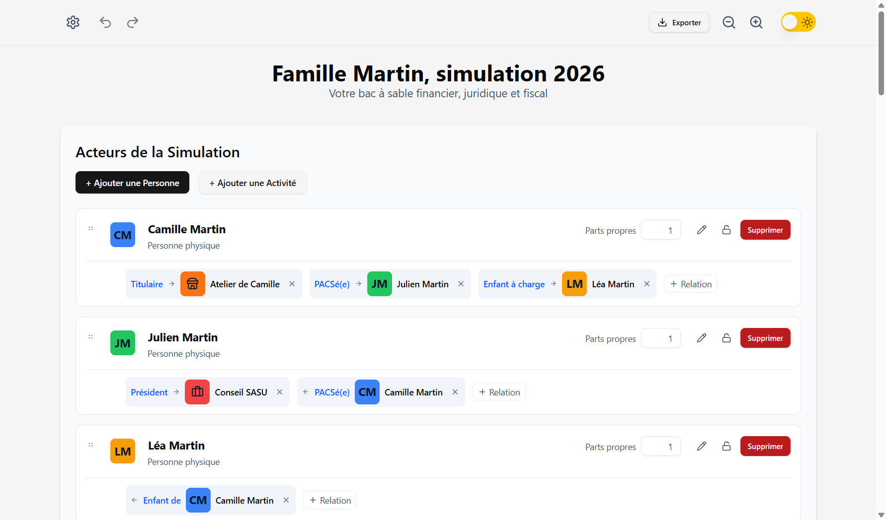
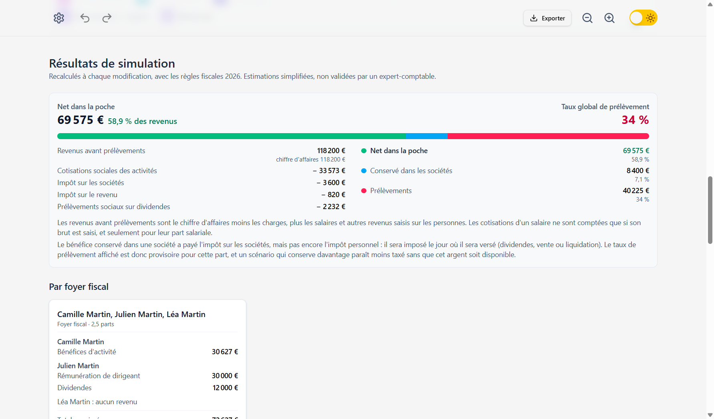
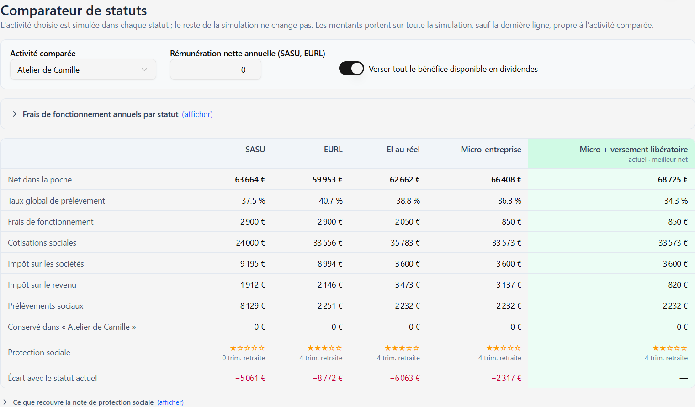
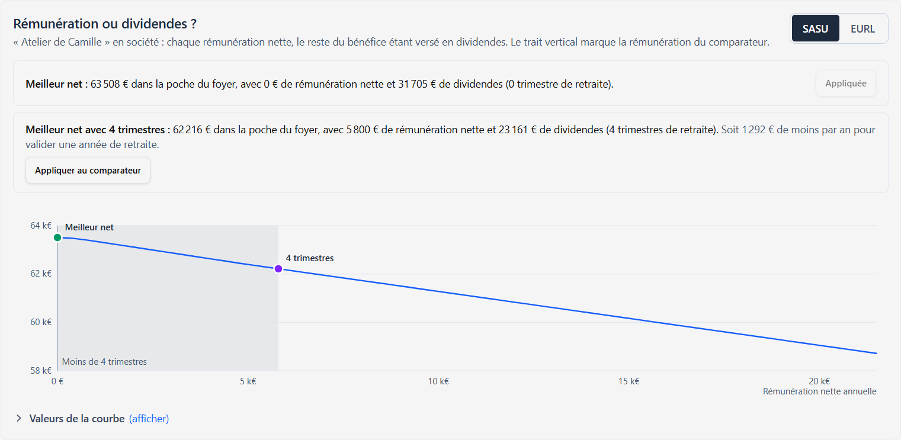

# Simulateur Indépendant FR (Proof of Concept)

[](https://github.com/DamienBecherini/simulateur-independant-fr/actions/workflows/ci.yml)
[](https://sonarcloud.io/summary/new_code?id=DamienBecherini_simulateur-independant-fr)
[](https://sonarcloud.io/summary/new_code?id=DamienBecherini_simulateur-independant-fr)
[](./LICENSE)
[](https://damienbecherini.github.io/simulateur-independant-fr/)
[](https://github.com/DamienBecherini/simulateur-independant-fr/issues?q=label%3Aretour)

Application desktop hors-ligne (Electron / React / TypeScript) conçue comme un bac à sable financier, juridique et fiscal pour les indépendants : on modélise personnes, sociétés et micro-entreprises, leurs liens et leurs flux mensuels, puis on calcule cotisations, impôts et net du foyer, et on compare les statuts : SASU, EURL, entreprise individuelle au réel, micro-entreprise avec ou sans versement libératoire.

**[▶ Essayer la démo en ligne](https://damienbecherini.github.io/simulateur-independant-fr/)**, sans installation : la même interface, le moteur de calcul tourne dans le navigateur et les simulations restent sur votre poste.

**Donner son avis :** le bouton « Donner mon avis » de l'application prépare un retour (note de 1 à 5, affichage préféré, avis, bug ou idée, tout facultatif) à envoyer en [ticket GitHub prérempli](https://github.com/DamienBecherini/simulateur-independant-fr/issues/new?template=retour.yml), public et avec un compte GitHub, ou par e-mail. Le badge « avis » ci-dessus affiche la note moyenne et le nombre de notes, recalculés à chaque retour : une seule note par compte GitHub (celle de son ticket le plus récent), sans les tickets marqués `invalide` ou `spam` ; les retours reçus par e-mail n'y entrent pas.

*Projet personnel, né d'un besoin d'entrepreneur. Je le partage pour montrer mes standards de code et ma vision produit, et parce qu'il peut aider d'autres entrepreneurs à y voir plus clair. Ce n'est pas un logiciel de conseil fiscal : les résultats sont indicatifs et n'ont pas été validés par un expert-comptable.*

## 📥 Télécharger

L'application de bureau pour Windows, macOS (Apple Silicon et Intel) et Linux se télécharge depuis la **[dernière version publiée](https://github.com/DamienBecherini/simulateur-independant-fr/releases/latest)**. Les exécutables ne sont pas signés par un certificat d'éditeur : Windows et macOS affichent un avertissement au premier lancement. Le [guide d'installation](./documentation/installation.md) explique comment le passer, système par système. Les changements de chaque version sont dans le [journal des modifications](./CHANGELOG.md).

## 🖼️ Aperçu

Simulation fictive : une indépendante en micro-entreprise mixte, pacsée avec le président d'une SASU, avec un enfant.

| Acteurs et relations | Résultats du foyer |
|---|---|
|  |  |





Les captures sont générées par `npm run captures` (Playwright, sur l'application compilée).

## ✨ Fonctionnalités

- **Modélisation par graphe** : entités (personnes, sociétés, micro-entreprises) reliées par des relations (Marié(e), PACSé(e), Enfant, Président, Gérant…).
- **Grille annuelle visuelle** : saisie des flux mois par mois, ajout, modification ou suppression d'un flux sur plusieurs mois en une fois, et recopie sur les mois suivants (loyer, abonnement, salaire), légende numérotée et couleurs personnalisables.
- **Simulation par foyer** : chaque activité (SASU, EURL, entreprise individuelle au réel, micro-entreprise) calcule ses cotisations et ce qu'elle verse ; l'impôt sur le revenu est ensuite calculé une seule fois par foyer fiscal (quotient familial plafonné, décote, dividendes au forfait ou au barème). Les résultats se recalculent à chaque modification.
- **Comparateur de statuts** : pour une activité, net dans la poche, taux de prélèvement, frais de fonctionnement détaillés et note de protection sociale (trimestres de retraite validés) en SASU, EURL, EI au réel et micro-entreprise (avec et sans versement libératoire) ; pour un couple en union libre, effet d'un mariage ou d'un PACS sur l'impôt.
- **Rémunération ou dividendes** : pour une société à l'IS (SASU, EURL), courbe du net du foyer selon la rémunération du dirigeant, le reste du bénéfice étant versé en dividendes ; meilleure rémunération, et meilleure parmi celles qui valident 4 trimestres de retraite, à reporter dans le comparateur en un clic. Par défaut, le comparateur place la SASU et l'EURL chacune à sa rémunération optimale qui valide 4 trimestres de retraite, tout le reste en dividendes, et affiche ce que coûte cette exigence en net (elle se décoche). Le partage du bénéfice se choisit (tout en rémunération, tout en dividendes, ou répartition personnalisée) sur une barre réglée à la souris, au doigt ou au clavier, qui montre où va chaque euro du bénéfice.
- **Frais réels et kilométrage** : trajets domicile-travail au barème kilométrique de l'année, un par lieu de travail (limite de 40 km par trajet, kilomètres additionnés par voiture), comparés automatiquement à la déduction de 10 % sur les salaires et rémunérations ; déplacements professionnels d'une activité convertis au barème, déductibles au réel, jamais en micro.
- **Plusieurs années** : une simulation couvre plusieurs années consécutives (2024 à 2026, et au-delà avec les dernières règles connues et un avertissement), chacune simulée avec ses propres règles ; le revenu fiscal de référence est calculé par foyer et reporté sur le versement libératoire deux ans plus tard ; un tableau compare les années. Jusqu'à dix années consécutives par simulation ; une charge ou un revenu récurrent s'ajoute, se modifie ou se supprime sur plusieurs années à la fois (cases « Aussi en » de la fenêtre des flux, avec raccourcis vers toutes les années, les précédentes ou les suivantes).
- **Affichage au choix (bêta)** : « Résumé », par défaut, qui garde les chiffres clés toujours visibles et replie le détail ; l'affichage classique, où tout est déplié ; « Trois vues » (ma situation, mes résultats, comparer et optimiser), chacune avec son adresse.
- **Réglages enregistrés** : les réglages du comparateur sont enregistrés avec la simulation et repris dans les sauvegardes, les exports et le rapport.
- **Scénarios** : sauvegardes nommées, chargement, import / export JSON, export et import de toutes les sauvegardes en un fichier.
- **Exports** : CSV pour Excel (grille, résultats, comparateur, courbe rémunération / dividendes), document PDF mis en page, rapport Markdown à lire ou à confier à une IA.
- **Pérennité des données** : validation Zod et réparation automatique des sessions à l'ouverture.
- **Confort d'édition** : undo / redo (Ctrl+Z / Ctrl+Y, Cmd+Shift+Z), sauvegarde automatique, glisser-déposer, zoom.
- **100 % hors-ligne** : aucune donnée ne quitte la machine.

## 📖 Documentation

- [Cahier des charges & architecture globale](./Cahier%20des%20charges.md)
- [Roadmap itérative](./Roadmap.md)
- [Guide développeur](./documentation/GUIDE_DEVELOPPEUR.md)
- [Décisions d'architecture (ADR)](./documentation/adr/)

## 🛠️ Stack technique

- **Application :** Electron (process principal Node.js, IPC typé via `contextBridge`).
- **Interface :** React 19, hooks maison (historique undo/redo, sauvegarde debounced).
- **Typage & validation :** TypeScript strict, Zod comme source de vérité unique.
- **Design system :** Tailwind CSS v4, ShadCN/UI, Lucide, dnd-kit.
- **Build :** Vite, electron-builder.

## ✨ Points d'intérêt dans le code

- `src/backend/logic/simulation-engine.ts` : moteur de simulation à sens unique (activités → revenus des personnes → impôt du foyer).
- `src/backend/logic/foyers.ts` : regroupement des foyers fiscaux par union-find (couples, enfants rattachés, parts).
- `src/backend/logic/regles.ts` + `src/backend/config.json` : toutes les règles fiscales de l'année, typées et sourcées, hors du code.
- `src/backend/logic/data-sanitizer.ts` : validation et réparation des sessions (relations et flux orphelins).
- `src/backend/logic/optimisation-remuneration.ts` : arbitrage rémunération / dividendes, par balayage puis affinage autour des optimums.
- `src/backend/util.ts` + `src/backend/preload.cts` : contrat IPC typé de bout en bout, sans `any` sur la surface exposée.
- `src/types.ts` : schémas Zod et types dérivés.
- `src/ui/hooks/useSessionManager.ts` : état de session, historique, sauvegarde asynchrone.
- `src/lib/business-logic.ts` : nettoyage du graphe lors de la rupture d'une relation.

## 🤖 Développement assisté par IA

Le projet est développé avec des agents IA qui travaillent directement dans le dépôt, sous relecture humaine. Leurs modifications passent par les mêmes garde-fous que le reste du code : tests, cas de référence, lint, vérification des types et intégration continue.

## 🚀 Démarrage rapide

Prérequis : Node.js 22 ou supérieur, npm.

```sh
git clone https://github.com/DamienBecherini/simulateur-independant-fr.git
cd simulateur-independant-fr
npm install
npm run dev
```

`npm run dev` lance Vite et Electron avec rechargement à chaud. Pour un exécutable : `npm run dist:win`, `npm run dist:mac` ou `npm run dist:linux`.

`npm run dev:web` lance la version navigateur (http://localhost:3524/simulateur-independant-fr/) ; `npm run build:web` la compile dans `dist-web/`.

## ✅ Qualité

```sh
npm test               # rapide : tests de la logique et des composants (Vitest)
npm run test:watch     # tests en mode interactif
npm run test:coverage  # tests + couverture (v8), rapport dans coverage/
npm run test:e2e       # compile l'application, puis tests de bout en bout (Playwright + Electron), fenêtres masquées
npm run test:e2e:visible  # les mêmes, fenêtres affichées pour suivre les tests
npm run test:web       # compile la démo web, puis la teste dans Chromium (Playwright)
npm run test:all       # tout : tests avec couverture, puis tests de bout en bout (application et démo web)
npm run lint           # ESLint, dont la complexité cyclomatique
npm run duplication    # détection de code dupliqué (jscpd)
npm run test:mutation  # tests de mutation (Stryker), rapport dans reports/mutation/
```

- **Tests** : fichiers `*.test.ts` placés à côté du code testé ; le moteur est testé avec des règles fictives aux chiffres ronds (`src/backend/logic/testing/`), pour que les montants attendus se vérifient de tête et ne dépendent pas du barème de l'année.
- **Cas de référence 2026** : `src/backend/logic/references/` fait tourner le moteur avec les règles réelles de `config.json` sur une soixantaine de situations (micro-entreprise, SASU, EURL, EI, salaires, familles, comparateur), dont chaque montant attendu est dérivé à la main des règles officielles ; ils échouent explicitement si `config.json` change d'année.
- **Valeurs limites** : chaque seuil est testé pile dessus et un euro au-delà (plafonds et TVA de la micro, revenu fiscal de référence du versement libératoire, 4 trimestres, plafond de la sécurité sociale, 3 SMIC de la réduction générale, dividendes d'EURL à 10 % du capital), ainsi que les noms hostiles dans les exports (séparateurs, retours à la ligne, formules), les fichiers retouchés à la main et les séries de flux en bord d'année.
- **Tests de composants** : fichiers `*.test.tsx` (React Testing Library, user-event, jsdom) qui rejouent les parcours de saisie au clavier, la fenêtre des flux, les cartes d'entités, les résultats et l'historique d'annulation ; `window.api` y est simulé (`src/ui/testing/`).
- **Tests de bout en bout** (optionnels) : fichiers `e2e/*.e2e.ts`, où Playwright pilote l'application Electron compilée (création d'entités, saisie dans la grille, résultats, historique, sauvegarde automatique, conversion d'un ancien format, sauvegardes nommées). Chaque test lance l'application sur un dossier de données temporaire (`--user-data-dir`), sans toucher aux vraies données ; aucun navigateur à télécharger. En intégration continue, ils tournent sur `main` et à la demande.
- **Démo web** : `e2e-web/*.web.ts` ouvre la version navigateur compilée dans Chromium (simulation d'exemple, calculs, conservation des modifications, retour à l'exemple). Elle nécessite une fois `npx playwright install chromium`. À chaque push sur `main`, la CI la teste puis la publie sur GitHub Pages.
- **Accessibilité (WCAG 2.2 AA, qui couvre le RGAA)** : audit axe-core de la démo web et de l'application dans les tests de bout en bout (chargement, comparateur déplié, mode sombre, téléphone, fenêtres), bloquant en CI ; tests dédiés des zones cliquables (24 px, 44 px sur écran tactile), des tailles de texte (12 px au moins, 14 px pour les phrases), du parcours au clavier avec focus visible et du curseur.
- **Couverture** : seuil bloquant de 90 % (instructions, branches, fonctions, lignes) sur `src/backend/logic/` et `src/lib/`.
- **Complexité** : règle ESLint `complexity` plafonnée à 15 sur `src/`, sans exception.
- **Mutation** : Stryker sur `src/backend/logic/` (score d'environ 86 %), lancé chaque semaine et à la demande ; nécessite Node.js 22 ou supérieur.
- **Intégration continue** : GitHub Actions exécute lint, vérification des types, tests avec couverture et build à chaque push et pull request.
- **SonarQube Cloud** (facultatif) : quand le secret `SONAR_TOKEN` est configuré, la CI envoie le code et la couverture à SonarQube Cloud (`sonar-project.properties`) ; sinon, elle se contente de la détection de code dupliqué.

## 🗂️ Structure du projet

- `documentation/` : guide développeur et ADR.
- `src/backend/` : process principal Electron (logique métier, calculs fiscaux, accès fichiers, IPC).
- `src/ui/` : application React (composants, hooks, interface).
- `src/lib/` : fonctions utilitaires et logique pure partagée.
- `src/web/` : démo web, qui remplace le process Electron : même `window.api`, moteur exécuté dans la page, stockage dans le navigateur.
- `src/types.ts` : schémas Zod et types centraux.
- `scripts/retours/` : scripts Node des retours des utilisateurs, lancés par les workflows GitHub. `etiqueter.mjs` pose les étiquettes d'un ticket du formulaire `.github/ISSUE_TEMPLATE/retour.yml` (`note-1` à `note-5`, `affichage-resume`, `affichage-classique`, `affichage-vues`, `avis`, `bug`, `idee`) ; `agreger.mjs` écrit à chaque publication de la démo le fichier `retours.json` (`nombreDeNotes`, `moyenne` au dixième, `preferencesAffichage`, `misAJour`, et `resume`, le texte du badge : « 4,2/5 (12 notes) » ou « pas encore de note »). Les retours sans note n'entrent pas dans la moyenne ; chaque compte GitHub n'y compte qu'une fois, par son ticket le plus récent qui donne une note (de même pour l'affichage préféré), et les tickets étiquetés `invalide` ou `spam` sont écartés.

## ⚠️ Limites connues

- POC : les résultats illustrent l'ingénierie, ils n'ont pas été validés par un expert-comptable.
- Les cotisations des travailleurs non salariés (gérant d'EURL, entrepreneur individuel au réel) sont calculées ligne à ligne selon le barème 2026 des artisans, commerçants et professions libérales non réglementées (assiette unique abattue de 26 %, assiettes minimales) ; ne sont pas modélisés les professions libérales réglementées, la contribution des artisans à la formation (0,29 %), le décalage entre cotisations provisionnelles et régularisation, ni la CSG déductible sur les dividendes soumis à cotisations. Celles du président de SASU et des salariés sont calculées ligne à ligne selon les taux 2026 du régime général (salarié : réduction générale dégressive comprise ; président : sans chômage ni réduction générale) ; ne sont pas modélisés la prévoyance et la mutuelle, l'APEC des salariés cadres, le régime d'Alsace-Moselle, le temps partiel, ni plus d'un employeur par personne ; le taux d'accident du travail retenu est celui des fonctions support (0,64 %).
- La note de protection sociale du comparateur est indicative : elle combine le régime et les trimestres de retraite validés.
- L'arbitrage rémunération / dividendes porte sur une année : il hérite des approximations ci-dessus et ne tient compte ni des droits à la retraite complémentaire ni du lissage sur plusieurs années.
- Non modélisés : réductions et crédits d'impôt, résidence alternée, report des déficits, TVA (seul le dépassement des seuils de franchise est signalé en micro-entreprise ; les montants sont hors taxe), répartition du capital entre associés (dividendes partagés à parts égales).

## 📄 Licence

[MIT](./LICENSE) © 2025-2026 Damien Becherini.
