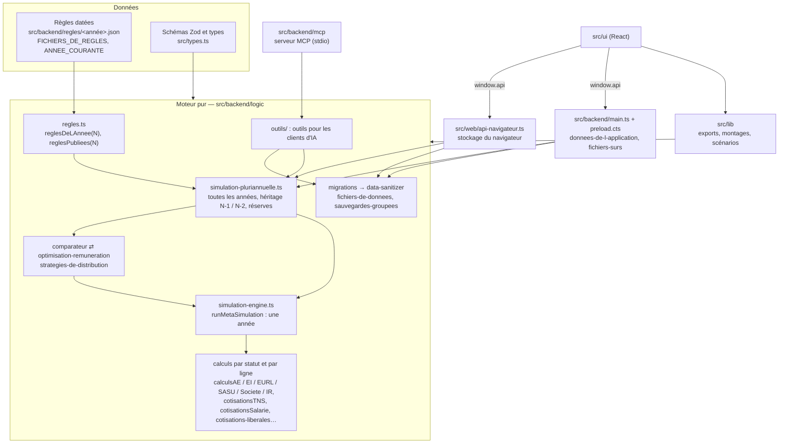
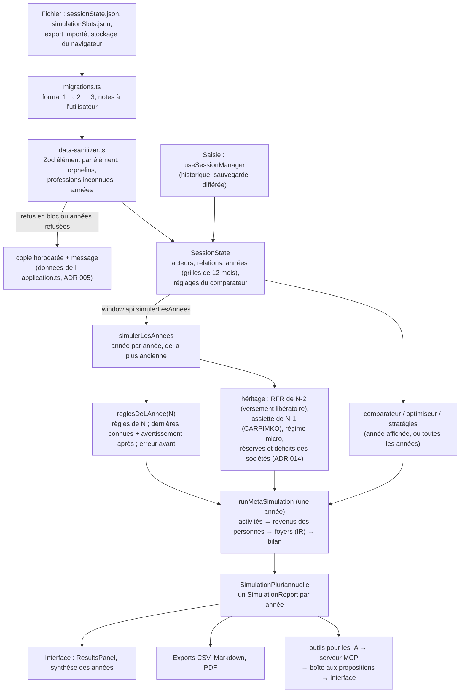

# Guide du développeur

Ce guide permet de maintenir et de faire évoluer le simulateur avec la seule documentation du dépôt et les tests. Il suppose que vous connaissez TypeScript, React et les bases d'Electron, pas la fiscalité française : le [glossaire](#5-glossaire) donne les notions métier et leur nom dans le code.

Chaque procédure de la partie 3 a été suivie réellement dans le dépôt (octobre 2026) : les fichiers, les erreurs et les tests cités sont ceux qu'on rencontre.

Les décisions et leurs raisons sont dans les [ADR](./adr/) ; ce guide y renvoie au lieu de les répéter.

## Sommaire

1. [Prise en main](#1-prise-en-main)
2. [Architecture](#2-architecture)
3. [Procédures pas à pas](#3-procédures-pas-à-pas)
4. [Sources officielles](#4-sources-officielles)
5. [Glossaire](#5-glossaire)

---

## 1. Prise en main

### 1.1 Prérequis et installation

- Node.js 22 ou plus récent, npm, git. Aucun autre outil : Electron et Playwright s'installent par npm.
- Windows, macOS ou Linux. Les commandes ci-dessous sont les mêmes partout.

```sh
git clone https://github.com/DamienBecherini/simulateur-independant-fr.git
cd simulateur-independant-fr
npm install
git config core.hooksPath .githooks   # une fois par clone : refuse un commit sur main (.githooks/README.md)
npm run installer:chromium            # une fois : le Chromium des tests de la démo web
```

### 1.2 Commandes

| Commande | Ce qu'elle fait | Quand |
|---|---|---|
| `npm run dev` | Vite (port 3524) et Electron, rechargement à chaud. Le bouton « Tests » de la barre d'outils n'existe qu'ici. | Développer l'application de bureau. |
| `npm run dev:web` | La démo web (moteur dans la page) sur http://localhost:3524/simulateur-independant-fr/. | Développer la démo. |
| `npm test` | Tests Vitest (logique sous Node, composants sous jsdom), sans couverture. | En continu. |
| `npx vitest run <fichiers>` | Seulement ces fichiers. Ajoutez `--reporter=verbose` pour voir les `console.log` d'un test qui réussit. | Après chaque petite modification. |
| `npm run test:coverage` | Tous les tests, avec la couverture (seuil bloquant : 90 % sur `src/backend/logic` et `src/lib`). Rapport dans `coverage/`. | Avant de commiter. |
| `npx tsc -b` | Types de l'interface, de `src/lib`, de `src/web` et des tests de bout en bout (pas `tsc -p .`, qui ne vérifie rien : `tsconfig.json` ne fait que référencer les projets). | Avant de commiter. |
| `npm run transpile:electron` | Types et compilation de `src/backend` (process principal, moteur, serveur MCP), puis empaquetage du serveur MCP. | Avant de commiter si `src/backend` a changé. |
| `npm run typecheck:tests` | Types des tests de `src/backend` et de `src/backend/logic/testing` (exclus des deux commandes précédentes). | Avant de commiter. |
| `npx eslint .` (ou `npm run lint`) | ESLint, dont la complexité cyclomatique ≤ 15 sur `src/`. | Avant de commiter. |
| `npm run duplication` | Code dupliqué (jscpd, 70 jetons ; tests, règles JSON et `testing/` exclus). Attendu : 0 clone. | Avant de commiter. |
| `npm run test:web` | Compile la démo web et la teste dans Chromium (`e2e-web/`). Port 4173 ; s'il est pris : `PORT_E2E_WEB=4391 npm run test:web`. | Avant de fusionner. |
| `npm run test:e2e` | Compile l'application et la teste avec Playwright + Electron (`e2e/`), fenêtres masquées (`test:e2e:visible` pour les voir). | Avant de fusionner. |
| `npm run test:all` | Couverture, puis les deux suites de bout en bout. | Avant de fusionner. |
| `npm run test:mutation` | Tests de mutation (Stryker) de `src/backend/logic` ; long. | De temps en temps. |
| `npm run build` / `npm run build:web` | Compile l'interface (`dist-react/`) ou la démo (`dist-web/`). | Rarement à la main. |
| `npm run dist:win`, `dist:mac`, `dist:linux`, `dist:store` | Exécutables (electron-builder). | Voir [publication.md](./publication.md). |
| `npm run captures` | Captures d'écran du README. | Après un changement visible. |

La CI (`.github/workflows/ci.yml`) lance lint, `typecheck`, `transpile:electron`, `typecheck:tests`, `test:coverage`, `build` et la duplication à chaque push ; `e2e.yml` les tests de bout en bout sur `integration` et `main` ; `demo-web.yml` teste et publie la démo à chaque push sur `main`.

**Vérification complète**, à lancer avant de proposer une fusion :

```sh
npx eslint . && npx tsc -b && npm run transpile:electron && npm run typecheck:tests \
  && npm run test:coverage && npm run duplication && npm run test:web && npm run test:e2e
```

### 1.3 Dossiers

| Dossier | Contenu |
|---|---|
| `src/types.ts` | Schémas Zod des données enregistrées (session, acteurs, flux, sauvegardes, préférences) et types des résultats du moteur. Listes fermées partagées : `CAISSES_LIBERALES`, `PUISSANCES_FISCALES`, `STATUTS_FRAIS`… |
| `src/backend/regles/` | Les règles fiscales et sociales, un fichier JSON par année (`2024.json`…), la liste `FICHIERS_DE_REGLES` et `ANNEE_COURANTE` (`index.ts`), leurs garde-fous (`regles.test.ts`). |
| `src/backend/logic/` | **Le moteur** : calculs purs, sans Electron, Node, React ni `src/lib`. Malgré son dossier, ce n'est pas un « backend » : il tourne aussi dans la page (démo web, interface) et dans le serveur MCP. Carte au § 2.3. |
| `src/backend/logic/references/` | Cas de référence : le moteur avec les règles réelles d'une année, montants dérivés à la main en commentaire. |
| `src/backend/logic/testing/` | Outils de test du moteur : règles fictives aux chiffres ronds (`regles-de-test.ts`), sessions de test, `casDeReference`. |
| `src/backend/logic/outils/` | Les outils pour les clients d'IA (ADR 010) : catalogue, lecture, propositions. Purs eux aussi. |
| `src/backend/mcp/` | Le serveur MCP local (ADR 011), processus à part lancé par le client d'IA. |
| `src/backend/*.ts` | Le process principal d'Electron : `main.ts` (fenêtre, canaux IPC), `preload.cts` (pont `window.api`), `util.ts` (canaux typés), `donnees-de-l-application.ts` (lecture et écriture des trois fichiers de données), `fichiers-surs.ts` (écriture atomique, copies), `boite-aux-propositions.ts`. |
| `src/lib/` | Logique côté interface, pure et testée : exports CSV et Markdown, montages types, scénarios de test, professions affichées, avis des utilisateurs… |
| `src/ui/` | Application React : `App.tsx`, `components/`, `hooks/` (`useSessionManager` : état, annuler et rétablir, sauvegarde différée). |
| `src/components/ui/` | Composants shadcn/ui, copiés tels quels (exclus de SonarQube). |
| `src/web/` | La démo web : `api-navigateur.ts` remplace le process principal (même `window.api`), `stockage-navigateur.ts` le disque ; `pwa/` la rend installable (ADR 012). |
| `src/globals.d.ts` | `EventPayloadMapping` : le contrat de `window.api`, commun à Electron et à la démo. |
| `e2e/`, `e2e-web/` | Tests de bout en bout (application de bureau, démo web). |
| `documentation/` | Ce guide, les ADR, la publication, les dossiers de recherche (`recherche/`), la relecture d'octobre 2026. |
| `scripts/` | Empaquetage du serveur MCP, paquet du Microsoft Store, scripts des retours des utilisateurs (`scripts/retours/`). |

### 1.4 Conventions

- **Français partout** : noms nouveaux, commentaires, messages, tests, commits. Exceptions qui restent en anglais : les clés du format de fichier (`entities`, `relationships`, `monthlyData`, types de flux comme `ca_services`), qu'on ne renomme pas sans migration (§ 3.5), et les noms existants des canaux IPC. Du code ancien est encore en anglais (`runMetaSimulation`, `buildFoyers`, `warnings`) : on ne le renomme qu'à l'occasion d'une branche prévue pour (relecture, C15).
- **Les commentaires disent pourquoi** : la règle appliquée et sa source, le cas limite, la raison d'un choix. Pas d'historique (« MODIFICATION », « nouvelle version »), pas de paraphrase du code.
- **Aucune valeur des règles dans le code ou un texte** : taux, plafonds, seuils et années viennent de `reglesDeLAnnee(annee)` ou de `reglesPubliees(annee)`. Une fonction du moteur reçoit toujours les règles en paramètre, jamais par défaut.
- **Tables exhaustives plutôt que « sinon »** : un traitement par caisse, statut ou type s'écrit dans un `Record<Union, …>` (ou un objet `satisfies Record<…>`), pour que le compilateur réclame chaque nouveau cas.
- **ESLint** sans erreur ; complexité ≤ 15 par fonction (au-delà, découpez). **SonarQube Cloud** analyse `main` : évitez ce qu'il classe en bogue (comparaison toujours vraie, `await` sur une valeur qui n'est pas une promesse, expression régulière à retour arrière sur une entrée non bornée, `sort()` sans comparateur sur des nombres…).
- **Tests à côté du code** (`x.ts` → `x.test.ts`), titres en français qui se lisent comme la règle vérifiée. Le moteur se teste avec les règles fictives (`reglesDeTest`) ; les montants réels, dans les cas de référence.
- **Branches** : jamais de commit sur `main` (crochet `pre-commit` et règle GitHub). Une branche courte par sujet, partie d'`integration` ; une fois la vérification complète au vert, elle est fusionnée dans `integration` (recette, CI et tests de bout en bout), puis `main` avance en avance rapide sur `integration`.
- **Commits** : `type: Phrase en français qui dit ce qui change` (`fix:`, `feat:`, `refactor:`, `test:`, `docs:`, `chore:`), une ligne, détails éventuels dans le corps. Exemple : `fix: La ligne d'information sous le choix de la profession décrit les règles de l'année affichée`.
- **CHANGELOG.md** : chaque changement visible de l'utilisateur va dans « Non publié » (Ajouté, Modifié, Corrigé).

---

## 2. Architecture

### 2.1 Couches et sens des dépendances



Règles de dépendance :

- `src/backend/logic` n'importe que `src/types.ts`, `src/backend/regles` et Zod. Un test (`outils/isolement.test.ts`) le vérifie pour les outils pour les IA ; pour le reste, vérifiez les imports d'un module ajouté.
- `src/lib` et `src/ui` peuvent importer le moteur ; le moteur ne les importe jamais.
- L'interface ne parle au disque que par `window.api` (contrat `EventPayloadMapping`, `src/globals.d.ts`), fourni par Electron (`preload.cts` → canaux de `main.ts`) ou par la démo (`creerApiNavigateur`).
- Écarts connus, assumés en attendant les branches prévues par la relecture : cycle `comparateur.ts` ⇄ `optimisation-remuneration.ts` (commenté dans le code), `simulation-pluriannuelle.ts` → `comparateur.ts` (conversion d'une micro sortie du régime), cycle `src/ui` ⇄ `src/web` (bandeau de la démo).

### 2.2 Flux de données



- **Persistance, application de bureau** : `main.ts` délègue à `donneesDeLApplication` (`src/backend/donnees-de-l-application.ts`) la lecture et l'écriture de `sessionState.json`, `simulationSlots.json` et `userPreferences.json` dans le dossier de données d'Electron. Toute écriture est atomique (`fichiers-surs.ts`) ; un fichier illisible ou en partie refusé est copié avant d'être remplacé (ADR 002, 005).
- **Persistance, démo web** : `src/web/api-navigateur.ts` applique les mêmes règles au `localStorage` (`stockage-navigateur.ts`) ; une session illisible y est remplacée par la simulation d'exemple.
- **Calcul** : dans Electron, l'interface appelle le moteur par IPC (`simulerLesAnnees`, `compareStatuts`, `optimiserRemuneration`, `comparerStrategies`), qui revalide la session ; dans la démo, le même moteur tourne dans la page.
- **Serveur MCP** : il relit `sessionState.json` à chaque appel (jamais ne l'écrit) et dépose les propositions acceptées dans `propositions/`, que `main.ts` surveille et transmet à l'interface (ADR 011).

### 2.3 Où vit quoi : carte du moteur

| Module (`src/backend/logic/`) | Rôle | Appelé par |
|---|---|---|
| `regles.ts` | Types des règles (`ReglesFiscales`), `reglesDeLAnnee`, `reglesPubliees`, `reglesDesAnneesConnues`. | tout le moteur, `src/lib`, l'interface |
| `simulation-pluriannuelle.ts` | `simulerLesAnnees` (toutes les années, héritages), `comparerStatutsDeLAnnee`, `optimiserRemunerationDeLAnnee`, `arbitrageDeLAnnee`. | `main.ts`, démo, outils pour les IA, tests |
| `simulation-engine.ts` | `runMetaSimulation` : une année ; routage des flux selon les relations ; micro-entreprises, sociétés, EI, salariés, foyers, bilan. | `simulation-pluriannuelle.ts`, comparateur, cas de référence |
| `calculsAE.ts` | Micro-entreprise : cotisations, abattement, versement libératoire, plafonds. | moteur |
| `calculsEI.ts`, `calculsEURL.ts`, `calculsSASU.ts`, `calculsSociete.ts` | Entreprise individuelle au réel ; sociétés à l'IS (IS, réserve légale, déficits). | moteur |
| `cotisationsTNS.ts` | Cotisations d'un travailleur non salarié (assiette abattue, lignes) ; revenu pour un net voulu. | EI, EURL |
| `cotisations-liberales.ts`, `professions.ts` | Caisses des libéraux réglementés : tables par caisse, profession → caisse (ADR 015). | `cotisationsTNS.ts`, moteur, `src/lib/professions.ts` |
| `cotisationsSalarie.ts` | Régime général : salarié, président de SASU, réduction générale, brut pour un net. | moteur |
| `calculsIR.ts`, `foyers.ts` | Impôt sur le revenu (quotient familial, décote) ; regroupement des foyers fiscaux. | moteur |
| `frais-kilometriques.ts` | Barème kilométrique, frais réels. | moteur |
| `dispositifs.ts` | ACRE, CFE de création, sortie du régime micro, prorata des plafonds. | moteur, `simulation-pluriannuelle.ts` |
| `protection-sociale.ts` | Trimestres de retraite, couverture par régime (note du comparateur). | comparateur |
| `comparateur.ts`, `optimisation-remuneration.ts`, `options-du-comparateur.ts`, `strategies-de-distribution.ts` | Comparaison des statuts, rémunération ou dividendes, stratégies sur plusieurs années. | `simulation-pluriannuelle.ts`, interface, outils |
| `annees.ts` | Années d'une session (`donneesDeLAnnee`, `NOMBRE_MAX_ANNEES`, `erreurDesAnnees`). | partout |
| `migrations.ts`, `data-sanitizer.ts`, `nettoyage-comparateur.ts`, `fichiers-de-donnees.ts`, `sauvegardes-groupees.ts` | Format de fichier : conversion, nettoyage, lecture et écriture des contenus. | `donnees-de-l-application.ts`, démo, serveur MCP |
| `baremes.ts`, `format.ts` | Barèmes par tranches et progressifs ; formatage. | calculs |

ADR à lire selon le sujet : persistance 002 et 005 ; IPC 003 ; état de l'interface 004 ; grille 006 ; années de règles 007 ; plusieurs années 008 ; réglages du comparateur 009 ; outils pour les IA 010 et 011 ; démo installable 012 ; Microsoft Store 013 ; réserves 014 ; libéraux réglementés 015.

---

## 3. Procédures pas à pas

Chaque procédure : les fichiers dans l'ordre, ce qu'on écrit, les tests, la commande de vérification et les pièges rencontrés en la suivant. Toujours sur une branche partie d'`integration`, terminée par la vérification complète (§ 1.2).

### 3.1 Ajouter l'année de règles 2027

**Quand :** dès que les valeurs de 2027 en vigueur au 1er janvier sont publiées (PASS et SMIC en décembre, taux Urssaf en janvier). Convention : ADR 007 (l'année N d'un fichier est celle de l'activité et des revenus).

1. **Créer `src/backend/regles/2027.json`** en copiant `2026.json`. Mettre `"annee": 2027` et `"derniereMiseAJour"` (date du jour, `AAAA-MM-JJ`). Puis reprendre **chaque bloc** : nouvelle valeur, `description` réécrite pour 2027, `source` (adresse directe de la page consultée). Ce qu'on prend pour 2027 :
   - **Impôt sur le revenu (`IR`)** : barème de la loi de finances pour 2028, qui n'existe pas encore. On garde celui de la loi de finances pour 2027 (ou, avant son vote, celui de 2026) et la `description` le dit (« appliqué aux revenus 2027 en attendant la loi de finances pour 2028 »).
   - **Plafond de RFR du versement libératoire** : celui qui ouvre l'option en 2027, apprécié sur les revenus de 2025.
   - **Tout le reste** (cotisations, PASS, SMIC, micro, ACRE, IS, dividendes, TVA, CFE, caisses de libéraux) : valeurs en vigueur pendant 2027 ; un changement en cours d'année garde la valeur du 1er janvier et la `description` cite la nouvelle et sa date.
   - **Barème kilométrique** : publié au printemps de l'année suivante ; reprendre le dernier connu en le disant.
   - **Une valeur introuvable** : reprendre celle de 2026 et écrire `NON SOURCÉ` dans la `description` (§ 4.3). Jamais de chiffre inventé.
2. **L'ajouter à la liste** `FICHIERS_DE_REGLES` de `src/backend/regles/index.ts` (import et entrée). `ANNEE_COURANTE` devient 2027 d'elle-même : nouvelle session, bandeau et manifeste de la démo, descriptions des outils pour les IA (la simulation d'exemple reste en 2026, voir l'étape 5). Le compilateur vérifie alors que le fichier respecte `ReglesFiscales`.
3. **Compléter `src/backend/regles/regles.test.ts`** : import de `2027.json`, constante `regles2027: ReglesFiscales`, entrée de `formesIdentiques` (même forme que 2026, descriptions comprises), entrée de la liste `annees`. Puis les tests nommés par année (CIPAV, retraite de base des libéraux, CARPIMKO, barème kilométrique « de 2024 à 2026 », réduction générale) : ajouter les valeurs de 2027 vérifiées sur les sources.
4. **Lancer les tests.** Ceux qui portent sur l'année en cours (session vierge, « dernières règles connues », année future) la calculent avec `ANNEE_COURANTE` ou `ANNEE_PAR_DEFAUT` (côté `e2e-web/`, `support/annees.ts`) et suivent d'eux-mêmes. Essai refait le 2026-10-10 avec une année 2027 identique à 2026 : **un seul test échoue**, `regles/regles.test.ts` (« chaque fichier du dossier est chargé »), tant que l'étape 3 n'est pas faite ; démo web et application : aucun échec. Avec un PASS, un taux micro et un plafond différents en 2027, s'y ajoutent seulement les cas de l'étape 6. Avant ce travail, le même essai faisait échouer 51 tests unitaires, 30 de la démo web et 1 de l'application. Un nouveau test qui parle de l'année en cours s'écrit de la même façon, jamais avec « 2026 » en dur.
5. **Ne pas toucher** : les cas de référence (`references/`, liés à 2026 par `REGLES_DES_CAS = reglesPubliees(2026)`), les montages types (`ANNEE_DES_MONTAGES = 2026`), la simulation d'exemple de la démo web (`ANNEE_DE_L_EXEMPLE = 2026`, `src/web/session-exemple.ts` : ses montants sont vérifiés par les tests de la démo et les captures du README), les scénarios du bouton « Tests » (années fixes), `ANNEE_DES_SESSIONS_D_UNE_ANNEE` (`migrations.ts`, valeur historique). Un remplacement global de « 2026 » par « 2027 » casserait tout cela. Le test `references/annee-suivante.test.ts` vérifie qu'une année ajoutée ne change aucun cas de 2026.
6. **Cas qui changent légitimement** : `references/dispositifs.reference.test.ts` simule 2027 et 2028 avec « les dernières règles connues » ; avec un PASS ou un taux micro différent en 2027, 6 de ses cas échouent (essai fait). Re-dériver leurs montants à la main avec les règles de 2027 (et 2027 pour 2028, tant que 2028 n'est pas connue), en gardant la dérivation en commentaire.
7. **Créer les cas de référence de 2027** : un fichier `references/regles-2027.reference.test.ts`, sur le modèle de `regles-2026.reference.test.ts`, avec ses propres règles (`reglesPubliees(2027)`) et une session en 2027 (voir § 3.6 : `simuler` de `cas-de-reference.ts` est figé sur 2026, appelez `runMetaSimulation(session(…), reglesPubliees(2027), { annee: 2027 })`). Au moins : micro BIC et BNC, EI au réel, SASU (président), EURL (gérant), un foyer avec IR.
8. **L'année précédente** : au vote de la loi de finances pour 2027 (en général entre décembre et février), mettre à jour le bloc `IR` de `2026.json` (barème, décote, plafonnement, déduction de 10 %), sa `description` et `derniereMiseAJour`, puis les cas de référence de 2026 dont l'impôt change (ils échouent : re-dériver ces montants seulement). Une année passée ne change plus ensuite, sauf loi rétroactive.
9. **Textes** : `README.md` (« 2024 à 2026 », « barème 2026 » des limites connues), `CHANGELOG.md` (Ajouté : règles de 2027).

**Vérification :** `npx vitest run src/backend/regles src/backend/logic/references`, puis la vérification complète, `test:web` et `test:e2e` compris.

**Pièges :** un test qui veut une année « après la dernière connue » ne peut pas l'écrire en dur (2027 cesse d'être future dès que son fichier existe) : il part de `ANNEE_COURANTE + 1` (`PREMIERE_ANNEE_FUTURE` dans `e2e-web/support/annees.ts`). La ligne « année N avec les règles fiscales M » de l'interface s'attend avec `ligneDeLAnnee(N)` du même fichier.

### 3.2 Ajouter un paramètre aux règles

Exemple essayé : un taux `TNS.contributionArtisans.taux`.

1. **Le type** : ajouter le champ dans l'interface concernée de `src/backend/logic/regles.ts`, avec un commentaire (ce qu'il représente, son unité : taux entre 0 et 1, montant en euros, part du PASS).
2. **Le compilateur liste alors ce qui manque** : `npx tsc -b` signale `src/backend/regles/index.ts` (chaque fichier JSON qui n'a pas le champ) ; `npm run typecheck:tests` signale aussi `testing/regles-de-test.ts` et `regles/regles.test.ts`. Vitest seul ne vérifie pas les types : sans ces deux commandes, rien n'échoue.
3. **Chaque fichier d'année** (`2024.json`, `2025.json`, `2026.json`…) : la valeur de cette année-là, avec `description` et `source` dans le bloc. Une année où la règle n'existait pas : la valeur neutre (0) et une `description` qui le dit (ADR 007, règle 5).
4. **Les règles fictives** `src/backend/logic/testing/regles-de-test.ts` : une valeur ronde.
5. **Si c'est un taux, l'ajouter à la liste `taux()` de `regles/regles.test.ts`** (ou `tauxDesLiberaux`). Sinon il n'est pas vérifié entre 0 et 1 : l'essai avec un taux de 1,5 passait tous les tests ; une fois ajouté à la liste, le test « a tous ses taux entre 0 et 1 » échoue comme il faut. Ajouter un test de cohérence d'une année à l'autre si la valeur ne doit jamais baisser.
6. **Le calcul** qui l'utilise, avec les règles reçues en paramètre ; son test unitaire avec `reglesDeTest`.
7. **Un cas de référence** (§ 3.6) si un montant réel change.
8. **Les textes** : si un libellé de l'interface ou un export cite la valeur, le construire à partir des règles de l'année affichée (jamais « 0,29 % » écrit en dur). **Les IA** : si elle doit être visible des clients d'IA, l'ajouter à `regles_de_l_annee` (`outils/lecture.ts`), en surveillant la taille du catalogue (§ 3.9).

**Vérification :** `npx tsc -b && npm run typecheck:tests && npx vitest run src/backend/regles <test du calcul>`.

### 3.3 Ajouter une caisse de libéraux (exemple : CARMF)

**Avant le code** : un dossier de recherche (`documentation/recherche/carmf.md`, sur le modèle de `caisses-des-liberaux.md` : barèmes, sources, cas calculés à la main) et une décision écrite (complément de l'ADR 015 ou nouvelle ADR) pour ce que le modèle ne sait pas faire (secteur 1 ou 2, ASV des médecins, classes d'invalidité-décès).

**Le compilateur guide l'ajout.** Ajoutez `"CARMF"` à `CAISSES_LIBERALES` (`src/types.ts`) et lancez `npx tsc -b`, `npm run transpile:electron` et `npm run typecheck:tests`. L'essai donne exactement ces erreurs, une par endroit à compléter :

| Erreur | Fichier | À écrire |
|---|---|---|
| `Property 'CARMF' is missing` sur chaque fichier JSON | `src/backend/regles/index.ts`, `regles/regles.test.ts` | Le type du bloc `CARMF` dans `ReglesLiberauxReglementes` (`regles.ts`), puis le bloc dans **chaque** fichier d'année, avec `description` et `source` |
| `Property 'CARMF' is missing` dans `CALCUL_PAR_CAISSE` | `logic/cotisations-liberales.ts` | Le calcul propre à la caisse : maladie restant due, complémentaire, ASV, prise en charge |
| Index `'CARMF'` impossible dans `PARTICULARITES_DES_CAISSES` | `logic/professions.ts` | Assiette de l'année précédente ou non ; taux micro propre ou non |
| `Property 'CARMF' is missing` dans `COUVERTURE_TNS` | `logic/protection-sociale.ts` | La couverture sociale, pour le comparateur |
| `TITRES_DES_CAISSES`, `INFORMATION_PAR_CAISSE` | `src/lib/professions.ts` | Le titre du groupe dans la liste et la ligne d'information |
| `Unused '@ts-expect-error'` | `logic/cotisations-liberales.test.ts` | Ce test simule l'ajout d'une caisse avec « CARMF » : remplacez ce nom par une caisse encore absente (« CARCDSF ») |

Puis les tests à l'exécution :

- `regles/regles.test.ts` « a, pour chaque caisse calculée, son bloc de règles et au moins une profession » : ajouter les professions de la caisse (médecin…) dans `professions.liste` de chaque fichier, avec leurs particularités (`microEntreprise`, `conventionnable`, `curps`, `societeExerciceLiberal`, `source`) ; et le test d'ordre de la liste (« santé, puis CIPAV, puis autre ») dans `regles.test.ts` et `src/lib/professions.test.ts`, à mettre à jour avec l'ordre décidé.

**Ce que le compilateur ne voit pas** (écrit caisse par caisse, à compléter à la main) : les règles exposées aux IA (`outils/lecture.ts`, `reglesDesLiberaux`), les textes des outils qui citent la CIPAV ou la CARPIMKO (`outils/comparaison.ts`, `outils/operations.ts`, `outils/resultats.ts`), les limites de l'export Markdown (`src/lib/export-markdown.ts`, « seules la CIPAV et la CARPIMKO sont calculées »), le README (fonctionnalités et limites connues).

**Tests à ajouter** : unitaires du calcul (`cotisations-liberales.test.ts`), cas de référence dérivés à la main du dossier de recherche (`references/liberaux.reference.test.ts`), libellés (`src/lib/professions.test.ts`), et si un champ est saisi (secteur), tout ce qu'exige un nouveau champ (§ 3.5).

**Vérification :** les trois commandes de types, puis `npx vitest run src/backend/regles src/backend/logic src/lib/professions.test.ts`, puis la vérification complète.

### 3.4 Ajouter un statut juridique ou un type de flux

**Un type de flux** (essai : `pension` sur une personne). Ajouter la valeur à l'énumération `type` de `FinancialFlowSchema` (`src/types.ts`). Le compilateur réclame alors : `flowTypeLabels` et `flowTypeShortLabels` (`src/lib/flow-constants.ts`), `DEFAULT_FLOW_COLORS` (`src/lib/color-constants.ts`), `SENS_DES_TYPES` (`outils/commun.ts`). Puis `src/web/rien-ne-se-perd.test.ts` échoue tant que `src/lib/testing/session-maximale.ts` ne contient pas un flux du nouveau type (`FLUX_PAR_ACTEUR`).

Le compilateur **ne réclame pas** le reste, et un oubli fait **ignorer le flux en silence** :

- le moteur : `simulation-engine.ts` additionne les types par listes (`total(ctx, id, "salary", "are", "other_taxable_income")`) ; ajouter le type là où il compte (revenu imposable, encaissé, chiffre d'affaires, charge…), avec un test unitaire et un cas de référence ;
- la saisie : `flowTypesByEntityType` et `getFlowTypesForEntity` (`flow-constants.ts`) ; `expenseFlowTypes` / `outgoingFlowTypes` si c'est une sortie d'argent ;
- les outils pour les IA : `TYPES_DE_FLUX`, `TYPES_PERMIS` et, s'il exige une relation, `RELATIONS_REQUISES` (`outils/commun.ts`) ;
- le format de fichier : une version précédente du simulateur écarte un flux de type inconnu et le compte dans « Flux invalides supprimés ». Le numéro de format n'a pas à changer (§ 3.5) ; dites-le dans le CHANGELOG.

**Un statut juridique** (essai : `"SARL"` dans `legalStatus` de `CompanySchema`). Le compilateur ne signale que `comparateur.ts` (`StatutCompare`), `outils/commun.ts` (genre d'acteur), `src/lib/entity-factory.ts` et `src/lib/montages/construction.ts`. **Le reste tombe dans un « sinon » sans erreur** : `simulation-engine.ts` calcule `legalStatus === "SASU" ? calculerSASU : calculerEURL` (une SARL serait calculée comme une EURL), `src/lib/graph-logic.ts` donne les relations permises de la même façon. Avant tout, cherchez `legalStatus ===` et `legalStatus !==` dans `src/` (une vingtaine d'endroits : moteur, exports, interface, migrations) et remplacez chaque ternaire du calcul par une table `Record<Company["legalStatus"], …>`. Puis : le calcul (`calculs<Statut>.ts` et son test), le comparateur (`STATUTS_COMPARES`, `STATUTS_FRAIS`, frais par défaut), la protection sociale, les exports, les outils (`TYPES_PERMIS`), `session-maximale.ts`, une ADR et des cas de référence. C'est une évolution de plusieurs jours, à découper.

### 3.5 Faire évoluer le format de fichier

Le format est versionné par `formatVersion` (`FORMAT_VERSION_ACTUEL`, `src/backend/logic/migrations.ts`), indépendant de la version de l'application. Arbre de décision (ADR 005, section « Versionnage du format ») :

- **Champ facultatif, avec une valeur par défaut, dont l'absence a un sens** (ADR 009, 014, 015) : **pas de nouveau numéro**. Ajouter le champ au schéma Zod (`.optional()` ou `.default()`, `.catch()` si une valeur invalide doit être écartée seule) ; un fichier ancien se lit tel quel, une version précédente ignore le champ.
- **Nouvelle valeur d'une énumération** (type de flux, statut) : pas de nouveau numéro ; une version précédente écarte l'élément et le signale.
- **Changement de sens d'une donnée existante, déplacement ou renommage de données** (ADR 008 : une grille → des années) : **nouveau numéro et migration**.

Pour un nouveau numéro :

1. `migrations.ts` : `FORMAT_VERSION_ACTUEL = 4` et une fonction `migrerV3VersV4(donnees)` ajoutée à la table `migrations` (clé `3`). Elle travaille sur des données **brutes**, avant Zod : défensive (`estObjet`, `tableau`), elle convertit ce qui peut l'être et rend des `notes` pour l'utilisateur sur ce qu'il doit vérifier. L'essai d'un numéro changé sans migration fait échouer 54 tests (`migrations[3] is not a function`) : on ne peut pas l'oublier.
2. `src/types.ts` : le nouveau schéma.
3. `migrations.test.ts` : un fichier au format 3 réel (copié d'un export) est converti, ses notes sont justes, et la chaîne 1 → 2 → 3 → 4 fonctionne.
4. La copie de l'original est déjà faite à la lecture (`sessionState.format-3.json`, `donnees-de-l-application.ts`, `copieAvantConversion`) : rien à écrire, mais vérifiez-la dans `donnees-de-l-application.test.ts` si la conversion perd quelque chose.
5. « Rien ne se perd » : `src/lib/testing/session-maximale.ts` doit remplir chaque champ du nouveau schéma ; `src/web/rien-ne-se-perd.test.ts` échoue sinon, puis fait passer cette session par chaque enregistrement et chaque relecture (nettoyage, fichiers, stockage du navigateur, sauvegardes groupées, export et import).
6. Le reste qui lit ou écrit le champ : `data-sanitizer.ts` (nettoyage élément par élément), `sauvegardes-groupees.ts`, les outils pour les IA (`outils/lecture.ts`, `operations.ts`), les exports.
7. Une ADR (ou un complément daté) et le CHANGELOG : un fichier au format 4 ouvert par une version précédente est signalé « créé par une version plus récente », puis lu avec ce qu'elle connaît.

**Vérification :** `npx vitest run src/backend/logic/migrations.test.ts src/backend/logic/data-sanitizer.test.ts src/backend/donnees-de-l-application.test.ts src/web/rien-ne-se-perd.test.ts`, puis `npm run test:e2e` (conversion d'un ancien format dans l'application).

### 3.6 Ajouter un cas de référence calculé à la main

Un cas de référence lance le moteur avec les règles **réelles** d'une année et compare à des montants **dérivés à la main** des textes officiels, la dérivation en commentaire. C'est le garde-fou des montants et le meilleur outil de débogage.

1. **Dériver d'abord, sans lancer le moteur** : la situation (acteurs, flux annuels), chaque ligne avec la règle, sa valeur dans le fichier de l'année et le calcul (« 9 000 x 23,2 % = 2 088 € »). Ne pas recopier la sortie du moteur : ce serait vérifier le moteur par lui-même.
2. **Choisir le fichier** de `src/backend/logic/references/` par sujet (micro, sociétés, salarié, libéraux, foyers…), ou en créer un `<sujet>.reference.test.ts`.
3. **Pour 2026**, utiliser les outils de `testing/cas-de-reference.ts` : `casDeReference(titre, corps)`, `simuler(acteurs, relations, flux)` (une année 2026 avec les règles de 2026), `activite(rapport, id)`, `foyerDe(rapport, idPersonne)`, `verifierIdentiteDuBilan(rapport)` ; les acteurs et flux avec `testing/session-de-test.ts` (`personne`, `societe`, `micro`, `relation`, flux `[idActeur, type, montantAnnuel]`). Modèle : `references/liberaux.reference.test.ts`.
4. **Pour une autre année**, ne pas utiliser `simuler` (figé sur 2026) : `runMetaSimulation(session(acteurs, relations, flux), reglesPubliees(2027), { annee: 2027 })`. Jamais `reglesDeLAnnee` dans un cas de référence : pour une année non publiée, elle rend les dernières règles connues, qui changeront.
5. **Plusieurs années** (versement libératoire, réserves, CARPIMKO) : construire une `SessionState` avec plusieurs `annees` et appeler `simulerLesAnnees` (modèle : `plusieurs-annees.reference.test.ts`).
6. Toujours finir par `verifierIdentiteDuBilan(rapport)` : il repère un montant perdu entre activités et foyers.
7. Si le nouveau fichier porte sur 2026, l'ajouter à la liste des imports de `references/annee-suivante.test.ts`, qui rejoue les cas avec une année de règles de plus.

**Vérification :** `npx vitest run src/backend/logic/references/<fichier>`.

### 3.7 Déboguer un calcul signalé faux

1. **Le signalement** arrive par le bouton « Donner mon avis » (ticket GitHub étiqueté `retour` et `bug`, ou e-mail). Il ne contient jamais de donnée de la simulation (version, système, nombre d'années et d'acteurs au plus). Demander à l'utilisateur, s'il l'accepte :
   - le **rapport Markdown** : « Exporter » → « Rapport complet (Markdown) » ; il contient les hypothèses, les acteurs, les flux, le détail des cotisations ligne à ligne, l'impôt du foyer et le comparateur ;
   - ou le **fichier de la simulation** : l'enregistrer dans une sauvegarde, puis panneau des paramètres → « Exporter cette sauvegarde… » (JSON).
2. **Reproduire dans l'application** : `npm run dev`, panneau des paramètres → « Importer une simulation… », puis lire la carte de l'activité (détail des cotisations dépliable), le foyer et la synthèse des années. Sans fichier, chercher un scénario proche dans le bouton « Tests » (§ 3.8) ou un montage type, et l'adapter.
3. **Reproduire dans un test**, pour isoler l'année et la ligne : un fichier temporaire `src/lib/debogage.test.ts` (à ne pas commiter) :

   ```ts
   import { readFileSync } from "node:fs"
   import { it } from "vitest"
   import { vueDeLAnnee } from "@/backend/logic/annees"
   import { lireLaSession } from "@/backend/logic/fichiers-de-donnees"
   import { simulerLesAnnees } from "@/backend/logic/simulation-pluriannuelle"
   import { rapportMarkdown } from "@/lib/export-markdown"

   it("reproduit le fichier signalé", () => {
     const { safeState } = lireLaSession(readFileSync("chemin/vers/simulation.json", "utf-8"))
     const pluriannuelle = simulerLesAnnees(safeState)
     const { annee, report } = pluriannuelle.annees[pluriannuelle.annees.length - 1]
     console.log(JSON.stringify(report?.activities, null, 2))
     console.log(rapportMarkdown({ session: vueDeLAnnee(safeState, annee), report, comparaison: null, date: new Date(), pluriannuelle }))
   })
   ```

   `npx vitest run src/lib/debogage.test.ts --reporter=verbose` (sans `--reporter=verbose`, les `console.log` d'un test qui réussit ne s'affichent pas). Écrire `annees[annees.length - 1]` et non `annees.at(-1)` : la cible de compilation de l'interface ne connaît pas `at` (erreur de `npx tsc -b`). Dans le rapport : `activities[].cotisationsTNS.cotisations` (lignes d'un indépendant), `cotisationsPresident`, `salaries`, `versementLiberatoire`, `acre`, `reserves`, `foyers[].impotSurLeRevenu`, `avertissements`. Une commande `npm run simuler -- fichier.json [année]` qui imprime ce rapport est à venir (branche `script-simuler`).
4. **Retrouver la règle** : `reglesDeLAnnee(annee)` (rapport : `anneeDesRegles`, et un avertissement si l'année reprend les dernières règles connues), le bloc du fichier `src/backend/regles/<année>.json`, sa `description` et sa `source`. Vérifier la valeur sur la source : l'erreur peut être dans les règles, pas dans le code.
5. **Refaire le calcul à la main** et l'écrire comme un **cas de référence** (§ 3.6) qui échoue avec le code actuel. Identité du bilan fausse : un montant est perdu ou compté deux fois entre activités et foyers (routage des flux dans `simulation-engine.ts`).
6. **Corriger**, dans les règles (avec une source) ou dans le calcul (avec un test unitaire sur `reglesDeTest`), jusqu'à ce que le cas passe ; vérifier qu'aucun autre cas de référence ne change sans raison. CHANGELOG (Corrigé), et réponse au ticket.

### 3.8 Ajouter un scénario au bouton « Tests »

Les scénarios (`src/lib/scenarios-de-test.ts`, `SCENARIOS_DE_TEST`) sont des sessions prêtes à charger pour vérifier une fonctionnalité à la main ; le bouton n'existe qu'en `npm run dev` (`import.meta.env.DEV`).

1. Ajouter un objet `ScenarioDeTest` : `id` et `titre` uniques, `resume` (la situation), `aVerifier` (ce qu'il faut regarder, dans l'ordre, où, et les chiffres attendus), `session()` construite avec les aides du fichier (`presidentEtSasu`, `liberal`, `sessionSurPlusieursAnnees`, `FACTURATION`…) et celles des montages (`src/lib/montages/construction.ts`). Années fixes (2024 à 2026), jamais `ANNEE_COURANTE`.
2. Sans rien écrire de plus, `src/lib/scenarios-de-test.test.ts` vérifie le nouveau scénario : identifiants uniques, années consécutives, passage au nettoyage sans perte, calcul de chaque année ; `ScenariosDeTest.test.tsx` vérifie qu'il s'affiche (essai fait : 42 tests verts).
3. Les chiffres de `aVerifier` ne sont **pas** vérifiés automatiquement : ajoutez-les dans le bloc « chiffres À vérifier » de `scenarios-de-test.test.ts` (modèle : les scénarios des libéraux), sinon ils deviennent faux en silence.

**Vérification :** `npx vitest run src/lib/scenarios-de-test.test.ts src/ui/components/ScenariosDeTest.test.tsx`, puis `npm run dev` → « Tests ».

### 3.9 Ajouter ou modifier un outil pour les IA

Lire d'abord les ADR 010 et 011 (« les chiffres viennent du moteur », « l'IA propose, l'utilisateur valide »).

1. **Un outil** se déclare avec `definirOutil({ nom, titre, description, lecture, parametres, resultat, executer })` (`outils/outil.ts`) dans le fichier de sa famille (`lecture.ts`, `resultats.ts`, `comparaison.ts`, `outils-de-proposition.ts`), puis s'ajoute à `OUTILS` (`catalogue.ts`). `nom` en minuscules et tirets bas ; `parametres` en `z.strictObject` ; `executer` pur, qui lève `ErreurOutil` avec un message en français disant quoi corriger. Une modification de la session ne passe que par une proposition (`operations.ts`) appliquée par `appliquer_proposition`.
2. **Plafonds de taille** : le catalogue (noms, descriptions, schémas des paramètres) est envoyé au modèle à chaque échange. `outils/catalogue.test.ts` le borne à 31 000 caractères et `mcp/serveur-mcp.test.ts` la liste publiée par le serveur à 33 000. **Mesuré en octobre 2026 : il reste environ 50 caractères sous le premier plafond** (essai : 2 500 caractères de description en plus font échouer les deux tests). Toute description allongée doit donc être compensée : resserrer une autre description, factoriser un rappel commun, décrire un paramètre en une phrase. Relever un plafond est une décision (il coûte à chaque échange) : l'écrire dans le test avec la raison, et dans l'ADR 010.
3. **Tests** : le test de l'outil compare son résultat au moteur sur la simulation d'exemple ou un montage (`src/web/outils-ia-*.test.ts`, aides de `outils-ia.testing.ts`) ; `outils/isolement.test.ts` refuse tout import hors du moteur, de Zod et des types ; `serveur-mcp.test.ts` vérifie la publication par le serveur.
4. **Serveur MCP** : rien à câbler, il publie `catalogueDesOutils()` ; les consignes données au modèle sont dans `src/backend/mcp/serveur-mcp.ts`. Après modification, `npm run transpile:electron` réempaquette le serveur.

**Vérification :** `npx vitest run src/backend/logic/outils src/backend/mcp src/web/outils-ia-*.test.ts`.

### 3.10 Publier une version

Suivre [publication.md](./publication.md) : numéro dans `package.json` seulement, CHANGELOG daté, étiquette `vX.Y.Z` poussée par le propriétaire, brouillon relu avant publication, Microsoft Store à part.

---

## 4. Sources officielles

### 4.1 Où chercher

| Sujet | Source |
|---|---|
| Textes en vigueur (codes, décrets, arrêtés) | [Légifrance](https://www.legifrance.gouv.fr/) : code général des impôts (CGI), code de la sécurité sociale (CSS), code de commerce, lois de finances (LFI) et de financement de la sécurité sociale (LFSS) |
| Doctrine fiscale, exemples chiffrés | [BOFiP-Impôts](https://bofip.impots.gouv.fr/) (identifiant `BOI-…` et date de la version) |
| Cotisations, PASS, taux des indépendants et des micro-entrepreneurs, ACRE, réduction générale | [Urssaf](https://www.urssaf.fr/) : pages « Taux et barèmes » ; [autoentrepreneur.urssaf.fr](https://www.autoentrepreneur.urssaf.fr/) pour la micro-entreprise |
| Barème de l'IR, décote, quotient familial, barème kilométrique | [service-public.gouv.fr](https://www.service-public.gouv.fr/) (fiches `F…`, actualités `A…`) et [impots.gouv.fr](https://www.impots.gouv.fr/) |
| Fiches entreprise (IS, TVA, CFE, réserve légale) | [entreprendre.service-public.gouv.fr](https://entreprendre.service-public.gouv.fr/) |
| Caisses des libéraux | [CNAVPL](https://www.cnavpl.fr/), [CIPAV](https://www.lacipav.fr/), [CARPIMKO](https://www.carpimko.com/), [CARMF](https://www.carmf.fr/)… : statuts, bulletins, guides annuels ; le décret qui fixe les taux fait foi sur la page de la caisse |

Quand deux sources se contredisent, citer celle qui fait foi (le texte), dire l'écart dans la `description`, et le noter dans le dossier de recherche (`documentation/recherche/`).

### 4.2 Comment les citer dans les règles

Dans `src/backend/regles/<année>.json`, chaque bloc porte :

- `description` : ce que représente la valeur, pour quelle année et pourquoi cette valeur-là (texte et article : « article D642-3 du code de la sécurité sociale », « décret n° 2025-1076, art. 12 »), la formule du simulateur si elle n'est pas évidente, et toute approximation ;
- `source` : l'adresse **directe** de la page consultée (`https://…`, vérifiée par `regles.test.ts`) ; une deuxième source se met dans un champ nommé (`sourceReduction`, `sourceRepartition`) ;
- au niveau du fichier, `derniereMiseAJour` : la date (`AAAA-MM-JJ`) de la dernière vérification.

Dans le code et les tests, un commentaire cite la règle (« 0,30 % dans la limite de 3 PASS, article D621-3 CSS ») plutôt qu'une adresse.

### 4.3 Ne jamais inventer un chiffre

Une valeur qu'aucune source ne donne n'est **pas** estimée en silence : on reprend la dernière valeur sourcée (l'année précédente, une page voisine) et la `description` le dit en capitales, `NON SOURCÉ` (exemples : ASV 2024 de la CARPIMKO, minimum de retraite de base 2025). Un test peut alors le vérifier (`toContain("NON SOURCÉS")`), et une recherche de `NON SOURC` dans `src/backend/regles/` donne la liste des valeurs à confirmer. Même règle dans les cas de référence : une dérivation qui s'appuie sur une valeur non sourcée le dit en commentaire.

---

## 5. Glossaire

| Notion | Sens | Dans le code |
|---|---|---|
| Acteur (entité) | Une personne, une société ou une micro-entreprise de la simulation. L'écran dit « acteur », le code et le fichier `entities`. | `Entity` (`Person`, `Company`, `MicroEntreprise`), `src/types.ts` |
| Relation | Lien entre deux acteurs : couple (Marié(e), PACSé(e), En couple), Enfant, Président, Gérant, Associé, Titulaire, Salarié. Elle route les flux (la rémunération va au président). | `Relationship`, `relationships` |
| Flux | Montant mensuel saisi dans la grille, d'un type donné (CA, charge, salaire, dividendes…). | `FinancialFlow`, `monthlyData`, types `ca_services`… |
| Année simulée | Une année civile de la session, avec sa grille et ses règles (ADR 008). | `annees`, `AnneeSimulee`, `DonneesDeLAnnee` |
| Année en cours | La plus récente année dont un fichier de règles existe ; année d'une nouvelle session. | `ANNEE_COURANTE`, `ANNEE_PAR_DEFAUT` |
| Statut | Forme juridique d'une activité : SASU, EURL, EI au réel, micro-entreprise (avec ou sans VFL). | `legalStatus`, `StatutCompare` |
| TNS | Travailleur non salarié : entrepreneur individuel, gérant majoritaire d'EURL ; cotise sur son revenu. | `cotisationsTNS.ts`, `ReglesTNS` |
| Assimilé salarié | Président de SASU : cotise au régime général, sans chômage. | `cotisationsSalarie.ts`, `cotisationsPresident` |
| SSI | Sécurité sociale des indépendants (Urssaf), régime des TNS non réglementés. | `COUVERTURE_TNS.SSI` |
| Assiette | Montant sur lequel s'applique un taux de cotisation. Pour un TNS : revenu avant cotisations abattu de 26 % (depuis 2025). | `assietteSociale`, `cotisationsTNS.assiette` |
| PASS | Plafond annuel de la sécurité sociale (48 060 € en 2026) ; beaucoup de tranches s'expriment en part du PASS. | `plafondSecuriteSociale`, `jusquA`, `…PartDuPlafond` |
| SMIC | Salaire minimum ; sert à la réduction générale et aux minimums. | `reductionGenerale.smicAnnuel` |
| Réduction générale | Réduction dégressive des cotisations patronales sur les bas salaires (ex-« Fillon »). | `reductionGenerale` |
| Micro-entreprise | Régime forfaitaire : cotisations en pourcentage du chiffre d'affaires, abattement forfaitaire pour l'impôt, plafonds de CA. | `calculsAE.ts`, `microEntreprise` |
| VFL | Versement libératoire : l'impôt d'une micro-entreprise payé en pourcentage du CA, ouvert sous un plafond de RFR. | `opteVFL`, `versementLiberatoire` |
| RFR | Revenu fiscal de référence du foyer ; celui de N-2 décide du VFL de l'année N. | `revenuFiscalDeReference`, `rfrN2` |
| ACRE | Aide à la création : cotisations réduites pendant les premiers trimestres. | `beneficieACRE`, `dateDeCreation`, `acre` |
| CFE | Cotisation foncière des entreprises ; non due l'année de création, réduite l'année suivante. | `CFE`, frais de fonctionnement `cfe` |
| BIC / BNC | Bénéfices industriels et commerciaux / non commerciaux (professions libérales) : catégories d'impôt et de taux micro. | `ca_micro_services_bic`, `servicesBnc` |
| IS | Impôt sur les sociétés (taux réduit puis normal). | `calculerIS`, `IS` |
| IR | Impôt sur le revenu, calculé une fois par foyer fiscal (quotient familial, plafonnement, décote). | `calculsIR.ts`, `IR`, `impotSurLeRevenu` |
| Foyer fiscal | Personnes imposées ensemble (couple marié ou pacsé, enfants rattachés). | `foyers.ts` (`buildFoyers`), `FoyerFiscalResult` |
| PFU | Prélèvement forfaitaire unique sur les dividendes (12,8 % d'IR + prélèvements sociaux), ou option pour le barème. | `dividendes.tauxIrForfaitaire`, `optionDividendes` |
| Réserves | Bénéfice gardé dans la société d'une année à l'autre, distribuable plus tard ; la réserve légale (un vingtième du bénéfice jusqu'au dixième du capital) ne l'est pas (ADR 014). | `reserves`, `reserveLegale`, `EtatDeLaSociete` |
| Déficit reportable | Perte d'une société imputée sur les bénéfices suivants. | `reportEnAvantDesDeficits`, `deficitImputable` |
| Profession réglementée | Profession libérale affiliée à une caisse de la CNAVPL ; la caisse se déduit de la profession par les règles de l'année (ADR 015). | `profession`, `ProfessionReglementee`, `caisseDe` |
| Caisse | Organisme de retraite d'une profession libérale : CIPAV, CARPIMKO (CARMF, CARCDSF, CNBF… non calculées). | `CAISSES_LIBERALES`, `CaisseLiberale`, `CALCUL_PAR_CAISSE` |
| CNAVPL | Caisse nationale des professions libérales : retraite de base commune à toutes les caisses. | `liberauxReglementes.commun` |
| Part conventionnée | Part des recettes d'un auxiliaire médical faite au tarif de la convention avec l'Assurance maladie, qui prend alors en charge une partie des cotisations. | `partConventionnee`, `priseEnCharge` |
| ASV | Avantage social vieillesse des auxiliaires médicaux conventionnés (CARPIMKO), en partie payé par l'Assurance maladie. | `asv` |
| CURPS | Contribution aux unions régionales des professionnels de santé (0,10 %, plafonnée). | `curps` |
| SEL | Société d'exercice libéral ; non modélisée, un avertissement le dit. | `societeExerciceLiberal` |
| Trimestres | Trimestres de retraite validés (4 au plus par an), selon le revenu cotisé. | `protection-sociale.ts`, `revenuParTrimestre` |
| Frais réels | Option de l'IR : déduire ses frais réels (trajets au barème kilométrique) au lieu des 10 %. | `fraisReels`, `frais-kilometriques.ts` |
| Comparateur | Une activité recalculée dans chaque statut, avec le même chiffre d'affaires. | `comparateur.ts`, `ComparaisonResult` |
| Optimiseur | Rémunération ou dividendes : la meilleure rémunération d'un dirigeant de société à l'IS. | `optimisation-remuneration.ts` |
| Montage type | Situation courante préremplie et sourcée, chargée par l'utilisateur. | `src/lib/montages/` |
| Scénario de test | Session de vérification manuelle, bouton « Tests » en développement. | `src/lib/scenarios-de-test.ts` |
| Cas de référence | Test du moteur avec les règles réelles et des montants dérivés à la main. | `src/backend/logic/references/` |
| Proposition | Modification de la session préparée par un client d'IA, appliquée seulement si l'utilisateur l'accepte. | `PropositionSchema` (`outils/propositions.ts`) ; `PropositionRecue` (`mcp/proposition-en-attente.ts`, contrat avec l'interface) |
| Format (numéro de) | Version du format des fichiers, indépendante de celle de l'application. | `formatVersion`, `FORMAT_VERSION_ACTUEL` |
| Nettoyage | Validation et réparation d'une session lue ou importée. | `data-sanitizer.ts`, `SanitizationReport` |
