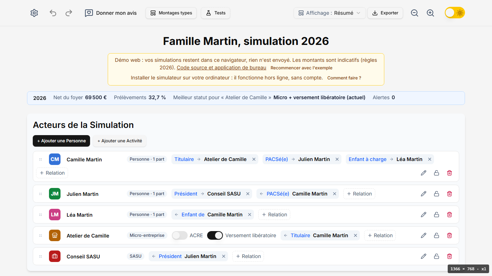
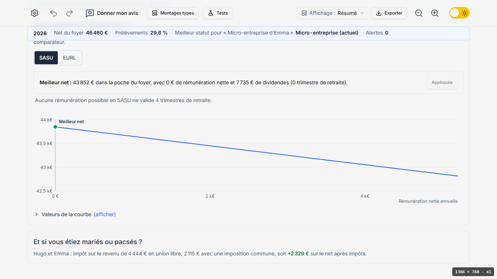
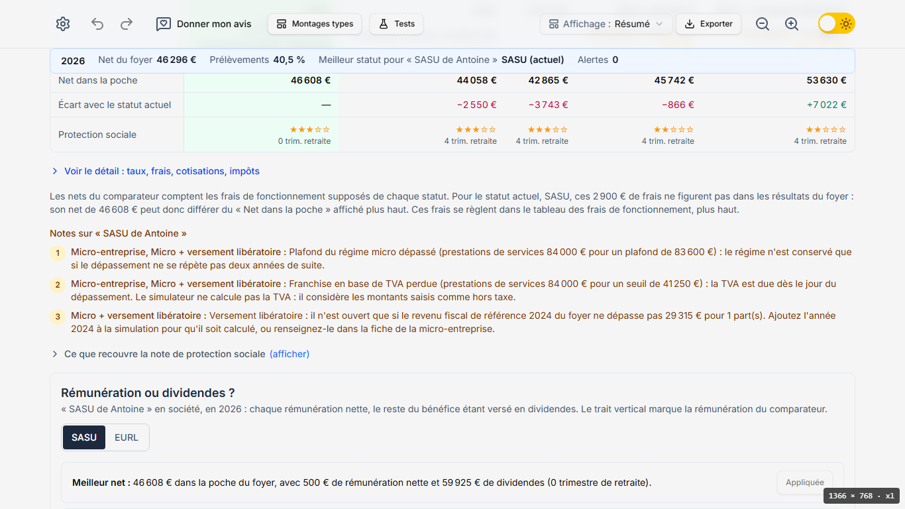

# Parcours utilisateur — octobre 2026

Analyse du parcours d'un nouveau venu sur la démo web, faite sur `integration` (commit `558be0e`, version 0.10.0), **sans modification du code** : ce document constate et propose ; les corrections viendront par petites branches, après validation.

## Sommaire

1. [Résumé](#1-résumé)
2. [Méthode](#2-méthode)
3. [Profil 1 : micro-entrepreneur développeur](#3-profil-1--micro-entrepreneur-développeur)
4. [Profil 2 : couple dont un seul est indépendant](#4-profil-2--couple-dont-un-seul-est-indépendant)
5. [Profil 3 : ostéopathe à la CIPAV](#5-profil-3--ostéopathe-à-la-cipav)
6. [Profil 4 : dirigeant de SASU](#6-profil-4--dirigeant-de-sasu)
7. [Constats transverses](#7-constats-transverses)
8. [Heuristiques de Nielsen et accessibilité](#8-heuristiques-de-nielsen-et-accessibilité)
9. [Valeur ajoutée face aux simulateurs officiels](#9-valeur-ajoutée-face-aux-simulateurs-officiels)
10. [Plan de branches proposé](#10-plan-de-branches-proposé)
11. [Questions à poser à de vrais utilisateurs](#11-questions-à-poser-à-de-vrais-utilisateurs)

---

## 1. Résumé

1. **Valeur ajoutée : forte.** Les quatre questions obtiennent une réponse chiffrée et sourcée ; deux d'entre elles (mariage ou Pacs, rémunération ou dividendes avec le coût de la retraite) n'existent pas en un écran chez les simulateurs officiels. Les montages types sont le meilleur atout.
2. **Trouvabilité : le point faible.** Le premier lancement montre l'exemple d'une autre famille, sans invitation à décrire sa situation ; les réponses sont au bas d'une longue page (mariage ou Pacs : 4,3 écrans de défilement au bureau, 6,7 sur téléphone) et la barre de résumé n'y mène pas.
3. **Complexité : raisonnable depuis un montage (3 à 7 actions), lourde depuis zéro (14 actions au bureau, 19 sur téléphone)**, avec deux pièges silencieux : chiffre d'affaires de micro en BIC par défaut, et deux « net » différents pour la même situation.
4. **À corriger vite :** la réinitialisation efface sans confirmation ni annulation possible ; le détail des cotisations d'un libéral au réel n'en ventile que 73 %.
5. Accessibilité de base soignée ; aucun constat bloquant, 7 majeurs, 12 mineurs, 1 cosmétique.

## 2. Méthode

- **Profils** : quatre personas joués en non-spécialiste, chacun avec sa question (voir chapitres 3 à 6). Je n'ai lu le code qu'après les parcours, pour vérifier ou expliquer un constat.
- **Outil** : Playwright (Chromium) piloté par des scripts hors du dépôt, sur le serveur de développement de la démo web (`http://localhost:3524/simulateur-independant-fr/`), stockage vide à chaque parcours (premier lancement), service worker bloqué.
- **Résolutions** : bureau 1366 × 768 ; téléphone 375 × 812 (tactile).
- **Mesures** : nombre d'actions (clic, choix dans une liste, champ rempli), champs saisis, position verticale de la réponse dans la page (en pixels, rapportée en « écrans » de 768 ou 812 px), hauteur totale de la page. Les durées relevées par les scripts (4 à 7 s par parcours) ne mesurent que l'automate ; les durées humaines données plus bas sont des **estimations**.
- **Limites de l'exercice** :
  - pas de vrais utilisateurs : les hésitations décrites sont celles qu'un non-spécialiste aurait **probablement** ; elles sont à valider (chapitre 11) ;
  - le serveur de développement affiche deux éléments absents de la démo publiée : le bouton « Tests » (scénarios de test, réservé au développement) et l'indicateur de taille d'écran en bas à droite des captures. Ils sont ignorés dans l'analyse ;
  - les simulateurs officiels n'ont pas été consultés : la comparaison du chapitre 9 s'appuie sur leurs fonctionnalités connues, à vérifier avant toute communication.

## 3. Profil 1 : micro-entrepreneur développeur

> « Je facture environ 55 000 € par an en micro-entreprise. Combien il me reste vraiment, et faut-il passer en SASU ou en EURL ? »

### 3.1 Premier lancement

Le stockage étant vide, la démo ouvre directement la simulation d'exemple « Famille Martin, simulation 2026 » : une micro-entrepreneuse pacsée avec un président de SASU, un enfant ([capture 01](parcours-utilisateur-2026-10/01-premier-lancement-bureau.png), [capture 02](parcours-utilisateur-2026-10/02-premier-lancement-mobile.png)). Tout est calculé : barre de résumé (net du foyer 69 500 €, prélèvements 32,7 %, meilleur statut, alertes), acteurs, grille, résultats, comparateur, courbe. C'est une bonne vitrine de ce que l'outil sait faire, mais **rien ne dit « décrivez votre situation »**. Le bandeau jaune propose « Recommencer avec l'exemple » et l'installation, pas de commencer.

Ce que la session d'exemple change : elle montre en une page toutes les fonctions (utile pour un recruteur ou un curieux) ; pour quelqu'un qui a une question, elle oblige à comprendre qu'il faut la remplacer, sans indiquer comment.

### 3.2 Parcours A : en partant d'un montage type

| Étape | Action | Observation |
|---|---|---|
| 1 | Cherche comment commencer | Hésitation probable entre « Montages types », l'engrenage et « + Ajouter une Personne ». « Montages types » est le bon choix, mais le libellé ne dit pas « partir d'une situation proche de la mienne ». |
| 2 | Clic « Montages types » | Huit montages, chacun avec une phrase et des étiquettes. « Micro-entreprise seule (BNC) » est le plus proche ; le sigle BNC n'est pas expliqué. |
| 3 | Clic « Détails » (facultatif) | Excellent : « Questions auxquelles il répond » (dont « Combien me reste-t-il ? » et « À partir de quel chiffre d'affaires une société devient-elle intéressante ? »), conditions, risques, cinq sources officielles ([capture 04](parcours-utilisateur-2026-10/04-montage-type-details.png)). |
| 4 | « Charger », puis « Remplacer » | Confirmation claire : l'exemple n'est pas enregistré, l'historique repart de zéro. |
| 5 | Cherche où changer 3 000 € en 4 583 € | Il faut cliquer une case du mois dans la grille. La saisie est **mensuelle** : il faut diviser 55 000 par 12 soi-même ; on obtient 54 996 €. |
| 6 | Fenêtre « Opérations de Janvier » | Un paragraphe d'instructions de six lignes précède les champs ([capture 05](parcours-utilisateur-2026-10/05-fenetre-des-flux.png)). Le type de flux est tronqué : « CA Micro - Services (B… ». |
| 7 | Modifie le montant, choisit « Tous les mois de l'année », « Terminé » | Message « Modifié aussi sur 11 autres mois. » Bon retour d'état. |
| 8 | Lit la barre de résumé | Net du foyer 39 597 €, prélèvements 28 %, meilleur statut « Micro + versement libératoire (actuel) », alertes 1. **Première réponse utile.** |
| 9 | Descend au comparateur (1 627 px, 2,1 écrans ; 2 730 px, 3,4 écrans sur téléphone) | Phrase de verdict claire. Tableau : Micro + VL 38 747 €, micro −2 783 €, SASU −5 008 €, EURL −6 153 €, EI −6 883 €. Note sur la franchise de TVA perdue ([capture 07](parcours-utilisateur-2026-10/07-resultats-et-comparateur-micro.png)). |
| 10 | Compare les deux nets | 39 597 € en haut, 38 747 € dans le comparateur pour le même statut. L'explication (850 € de frais supposés) est dans un paragraphe sous le tableau. Doute probable : « lequel est mon vrai net ? » |

**Mesures** : 7 actions, 2 champs (montant, « Appliquer à »), 1 confirmation ; réponse « combien il me reste » dans la barre de résumé dès la fin de l'étape 7 ; réponse « SASU ou EURL » 2,1 écrans plus bas (3,4 sur téléphone). Temps humain estimé : 2 à 4 minutes.

### 3.3 Parcours B : en partant de zéro

Engrenage, « Nouvelle Simulation / Réinitialiser » ([capture 03](parcours-utilisateur-2026-10/03-parametres-reinitialiser.png)), puis : ajouter une personne, ajouter une activité, choisir « Micro-Entreprise », relier l'activité à la personne, ouvrir une case de la grille, saisir le montant, choisir « Tous les mois de l'année », valider.

| Mesure | Bureau | Téléphone |
|---|---|---|
| Actions depuis l'engrenage, type BNC choisi | 14 | 19 |
| Champs saisis | 2 (+ le nom, facultatif) | 2 |
| Relation « Titulaire » | sur la carte : « + Relation », « Avec… », la personne (3 actions, type choisi d'office) | seulement par la fiche (crayon) : « Ajouter une relation », « Lier avec », « Type de relation », « Confirmer », « Enregistrer » ([capture 09](parcours-utilisateur-2026-10/09-mobile-fiche-relation.png)) |

Pièges rencontrés :

- **Le type de flux proposé par défaut est « CA Micro - Services (BIC) »** ([capture 06](parcours-utilisateur-2026-10/06-type-de-flux-bic-par-defaut.png)). Un développeur qui ne connaît pas la différence BIC / BNC valide tel quel : le calcul retient le taux de cotisations des prestations commerciales (21,2 % en 2026) au lieu de celui des libéraux non réglementés (25,6 %), soit environ 2 400 € de cotisations en moins sur 55 000 €, et l'abattement fiscal de 50 % au lieu de 34 %. Rien ne l'alerte. Résultat obtenu : 41 529 € nets (BIC, sans versement libératoire), contre 39 597 € pour le montage BNC avec versement libératoire ; les deux chiffres diffèrent aussi par le versement libératoire, mais l'écart dû au seul type d'activité suffit à fausser la réponse.
- Avant toute saisie, la barre de résumé annonce « Meilleur statut : SASU, +850 € » pour un chiffre d'affaires nul (capture 06, en haut) : le verdict est calculé sur les seuls frais supposés.
- « Nouvelle Simulation / Réinitialiser » efface la simulation en cours **sans confirmation** et désactive « Annuler » (vérifié : le bouton d'annulation est grisé juste après) ; voir P-01.

## 4. Profil 2 : couple dont un seul est indépendant

> « Hugo est salarié, Emma est en micro-entreprise. Mariage ou Pacs, quel effet sur notre impôt ? »

| Étape | Action | Observation |
|---|---|---|
| 1 | « Montages types » | Le montage « Couple en union libre, puis marié ou pacsé » formule exactement la question. Très bon. |
| 2 | « Détails » (facultatif) | Questions, conditions (imposition distincte l'année de l'union), risques non fiscaux, sources. Indique aussi « remplacez la relation En couple par Marié(e) ou PACSé(e) » pour voir le foyer commun. |
| 3 | « Charger », « Remplacer » | Barre de résumé : net 46 460 €, meilleur statut « Micro-entreprise (actuel) ». **Aucune mention du mariage ou du Pacs.** |
| 4 | Lit « Résultats » | Deux foyers fiscaux : Hugo 4 444 € d'impôt, Emma 0 €. Bonne lecture de la situation actuelle. |
| 5 | Descend | Comparateur de statuts de la micro d'Emma, puis courbe « Rémunération ou dividendes ? » de cette micro passée en société : hors sujet pour la question, et long. |
| 6 | Trouve « Et si vous étiez mariés ou pacsés ? » | Dernier bloc de la page, à 3 332 px sur 3 648 (4,3 écrans) ; 5 465 px sur 5 939 sur téléphone (6,7 écrans). « Impôt sur le revenu de 4 444 € en union libre, 2 115 € avec une imposition commune, soit +2 329 € sur le net après impôts. » ([capture 10](parcours-utilisateur-2026-10/10-mariage-pacs-bureau.png), [capture 11](parcours-utilisateur-2026-10/11-mariage-pacs-mobile.png)) |

**Mesures** : 3 actions (4 avec « Détails »), aucun champ ; réponse à 4,3 écrans de défilement au bureau, 6,7 sur téléphone. Temps humain estimé : 1 à 3 minutes avec le montage ; en partant de zéro (deux personnes, relation « En couple (union libre) », activité, relation « Titulaire », salaire et chiffre d'affaires), une vingtaine d'actions (estimation d'après le parcours 1B, non mesurée).

Constats propres au profil :

- La réponse est juste et lisible, mais **enfouie** sous des blocs sans rapport (P-05).
- Mariage et Pacs ne sont pas distingués : c'est exact pour l'impôt sur le revenu, mais la phrase ne le dit pas ; un utilisateur qui demande « mariage **ou** Pacs » attend qu'on lui dise que l'effet est le même et pourquoi.
- Le bloc n'existe que pour un couple en union libre. Un couple déjà pacsé (comme la famille Martin de l'exemple) ne voit pas l'effet inverse (« et si nous déclarions séparément ? »), ni l'année de l'union où l'imposition distincte reste possible.

## 5. Profil 3 : ostéopathe à la CIPAV

> « Je suis ostéopathe. Mes cotisations sont-elles justes ? »

| Étape | Action | Observation |
|---|---|---|
| 1 | « Montages types » | Aucun montage de profession libérale réglementée. Un « Ostéopathe en micro-entreprise » existe, mais seulement dans les scénarios de test du développeur. Choix par défaut : « Micro-entreprise seule (BNC) ». |
| 2 | « Charger », « Remplacer » | Situation de Sophie, conseil BNC. |
| 3 | Cherche où indiquer « ostéopathe » | Rien sur la carte ; il faut ouvrir le crayon (« Modifier les autres réglages »). Hésitation probable. |
| 4 | Liste « Profession » | 28 professions ; « Ostéopathe » est la 16e. Sous la liste, une phrase précise : caisse CIPAV, micro à 23,2 %, taux au réel ([capture 12](parcours-utilisateur-2026-10/12-profession-osteopathe.png)). Très bon. |
| 5 | « Enregistrer » | La carte affiche « Micro-entreprise · Ostéopathe (CIPAV, 23,2 % du chiffre d'affaires) ». Cotisations 8 424 € pour 36 000 €, dont 72 € de formation professionnelle. **Réponse vérifiable pour la micro** : un seul taux, comme sur la déclaration Urssaf. |
| 6 | Essaie le cas courant de l'ostéopathe au réel | La fiche d'une micro n'a pas de champ « Statut » (celles de l'EI, de la SASU et de l'EURL en ont un) : il faut recréer une activité « Entreprise individuelle (au réel) », la relier (ici le type de relation n'est pas choisi d'office : « Titulaire » ou « Salarié ») et ressaisir le chiffre d'affaires. |
| 7 | Lit le détail de l'EI (54 000 € de recettes) | Cotisations 15 008 €, dont maladie 2 061 €, retraite de base 4 236 €, complémentaire CIPAV 4 396 €, invalidité-décès 200 € ([capture 13](parcours-utilisateur-2026-10/13-cotisations-ei-osteopathe.png)). **Les quatre lignes font 10 893 € : 4 115 € ne sont pas ventilés** (vraisemblablement CSG-CRDS, allocations familiales et formation professionnelle ; supposition, l'écran ne le dit pas). |
| 8 | Cherche si le simulateur gère l'appel provisionnel et la régularisation | Rien dans l'application ; la limite est écrite dans le README seulement. |

**Mesures** : 7 actions pour un ostéopathe en micro (montages types, charger, remplacer, crayon, liste, profession, enregistrer) ; pour l'EI au réel en partant de zéro, environ 17 actions au bureau. Temps humain estimé : 3 à 6 minutes. **La question « sont-elles justes ? » n'obtient qu'une réponse partielle** : le total est donné, la ventilation est incomplète et l'écart attendu avec l'appel de l'Urssaf (provisionnel, régularisation) n'est pas expliqué.

Points forts propres au profil : la caisse se déduit de la profession, la phrase sous la liste donne les taux, et le comparateur prévient avec soin que la SASU et l'EURL classiques ne conviennent en principe pas (société d'exercice libéral). Ces notes sont toutefois longues (six lignes chacune) et répétées pour la SASU et l'EURL.

## 6. Profil 4 : dirigeant de SASU

> « Je préside une SASU qui facture 84 000 € par an. Rémunération ou dividendes, quel arbitrage ? »

| Étape | Action | Observation |
|---|---|---|
| 1 | « Montages types » | Quatre montages avec une SASU, dont « SASU avec un salaire qui valide 4 trimestres » : le vocabulaire (trimestres) est celui de la question. |
| 2 | « Charger », « Remplacer » | Barre de résumé : net 46 296 €, meilleur statut « SASU (actuel) ». |
| 3 | Descend jusqu'à « Rémunération ou dividendes ? » | À 2 603 px sur 3 477 (3,4 écrans) ; 4 339 px sur 5 603 sur téléphone (5,3 écrans). |
| 4 | Lit la réponse | « Meilleur net : 46 608 € avec 500 € de rémunération nette et 59 925 € de dividendes (0 trimestre). Meilleur net avec 4 trimestres : 45 780 €, avec 5 800 € de rémunération nette. Soit 828 € de moins par an pour valider une année de retraite. » Courbe et bouton « Appliquer au comparateur » ([capture 15](parcours-utilisateur-2026-10/15-remuneration-dividendes.png)). **Réponse excellente**, avec le compromis qui intéresse vraiment un dirigeant. |
| 5 | Remonte au comparateur | La colonne « SASU, actuel » affiche 0 trimestre de retraite et une rémunération de 500 € : ce n'est **pas** la situation saisie (12 000 € nets par an, 4 trimestres), mais la SASU à sa rémunération optimale (mode « Meilleur net »). Confusion probable. |
| 6 | Lit la colonne « Micro + versement libératoire » | +7 022 € en vert, le plus gros chiffre du tableau ; pourtant la phrase de verdict et la barre de résumé désignent la SASU. La raison (une micro au-delà de son plafond n'est jamais désignée) se devine à la note 1, qui signale le dépassement, mais le tableau ne dit pas que la colonne est écartée. |

**Mesures** : 3 actions, aucun champ ; réponse à 3,4 écrans (5,3 sur téléphone). Temps humain estimé : 1 à 2 minutes avec le montage.

## 7. Constats transverses

Gravité : **bloquant** (empêche d'obtenir la réponse), **majeur** (réponse fausse, introuvable ou source de doute pour une partie des utilisateurs), **mineur** (gêne, contournable), **cosmétique**. Effort : **S** (moins d'une journée), **M** (quelques jours), **L** (plus).

Aucun constat bloquant : chaque question obtient une réponse.

| Id | Constat | Gravité | Effort | Preuve | Recommandation |
|---|---|---|---|---|---|
| P-01 | « Nouvelle Simulation / Réinitialiser » remplace la simulation **sans confirmation** et vide l'historique : « Annuler » est grisé juste après. Le chargement d'un montage, lui, demande confirmation. | majeur | S | capture [03](parcours-utilisateur-2026-10/03-parametres-reinitialiser.png) ; parcours 1B ; `useSessionManager.ts`, `handleResetSession` | Même confirmation que pour un montage (« n'est pas enregistrée dans une sauvegarde ») ; mieux, garder l'état précédent dans l'historique pour qu'« Annuler » le restaure. **Traité : branche `reinitialisation-sure`.** |
| P-02 | Pas de point d'entrée « ma situation » : le premier lancement montre l'exemple Famille Martin ; partir de sa propre situation passe par « Montages types » (nom d'outil, pas de question) ou par l'engrenage. | majeur | M | captures [01](parcours-utilisateur-2026-10/01-premier-lancement-bureau.png), [02](parcours-utilisateur-2026-10/02-premier-lancement-mobile.png) ; § 3.1 | Au-dessus de l'exemple, un encart « Que voulez-vous savoir ? » qui reprend les questions des montages (« Combien me reste-t-il ? », « Société ou micro ? », « Mariage ou Pacs ? », « Rémunération ou dividendes ? », « Mes cotisations ») et « Partir de zéro ». Renommer « Montages types » en « Partir d'une situation type ». |
| P-03 | Le chiffre d'affaires d'une micro est en « Services (BIC) » par défaut, libellé tronqué (« Services (B… »), sans explication BIC / BNC. Un libéral non averti obtient un résultat faux sans alerte. | majeur | S | capture [06](parcours-utilisateur-2026-10/06-type-de-flux-bic-par-defaut.png) ; parcours 1B | Demander la nature de l'activité à la création de la micro (vente, prestation commerciale ou artisanale, prestation libérale), avec un exemple de métiers pour chacune ; libellés complets dans la liste ; rappel de la nature sur la carte. **Traité : branche `nature-de-l-activite-micro`** (nature choisie et expliquée dans la fenêtre des flux, avec taux de l'année et exemples ; proposée d'office : celle déjà saisie, sinon prestations libérales ; rappel sur la carte non fait). |
| P-04 | Deux « net » pour la même situation (résultats et comparateur, à cause des frais supposés), et une colonne « actuel » du comparateur qui n'est pas la situation saisie (rémunération optimale, pas celle de la grille). | majeur | M | capture [07](parcours-utilisateur-2026-10/07-resultats-et-comparateur-micro.png) ; § 3.2 étape 10 ; § 6 étape 5 | Une ligne « Votre situation, telle que saisie » en tête du comparateur, égale au net des résultats ; renommer « actuel » en « même statut, rémunération optimisée » quand le mode n'est pas « Selon la grille » ; afficher l'écart dû aux frais supposés dans la cellule plutôt que sous le tableau. |
| P-05 | Les réponses sont loin et la barre de résumé n'y mène pas : mariage ou Pacs en dernier bloc (4,3 écrans, 6,7 sur téléphone), rémunération ou dividendes à 3,4 écrans (5,3), après des blocs parfois hors sujet. | majeur | M | captures [10](parcours-utilisateur-2026-10/10-mariage-pacs-bureau.png), [11](parcours-utilisateur-2026-10/11-mariage-pacs-mobile.png), [15](parcours-utilisateur-2026-10/15-remuneration-dividendes.png), [16](parcours-utilisateur-2026-10/16-remuneration-dividendes-mobile.png) ; § 4, § 6 | Ajouter à la barre de résumé une entrée par réponse disponible (« Mariage ou Pacs : +2 329 € », « Rémunération optimale : 5 800 € ») qui y conduit ; placer la comparaison du couple avant la courbe ; dans « Trois vues », sous-ancres de « Comparer et optimiser ». |
| P-06 | Le détail des cotisations d'un indépendant au réel ne ventile qu'une partie du total (10 893 € sur 15 008 € pour l'ostéopathe). | majeur | S | capture [13](parcours-utilisateur-2026-10/13-cotisations-ei-osteopathe.png) ; § 5 étape 7 | Ventiler toutes les lignes (CSG-CRDS, allocations familiales, formation professionnelle…), avec leur assiette et leur taux, pour pouvoir rapprocher l'appel de l'Urssaf ligne à ligne. **Traité : branche `cotisations-detaillees-et-limites`.** |
| P-07 | Les limites du modèle (provisionnel et régularisation, prévoyance, réductions et crédits d'impôt, autres caisses de libéraux) ne sont écrites que dans le README ; dans l'application, seuls un avertissement générique en pied de page et quelques notes au cas par cas (TVA, plafonds). | majeur | S | § 5 étape 8 | Un dépliant « Ce que le simulateur ne calcule pas » près des résultats et dans chaque montage, repris des « Limites connues » du README ; pour une profession libérale, une phrase sur l'écart attendu avec l'appel provisionnel. **Traité : branche `cotisations-detaillees-et-limites`** (sous le titre des résultats et sous le total des cotisations d'un travailleur non salarié ; pas dans chaque montage). |
| P-08 | La grille ne se saisit que par mois : 55 000 € par an donnent 54 996 €. | mineur | S | § 3.2 étape 5 | Dans la fenêtre des flux, un choix « montant annuel, réparti sur les 12 mois ». **Traité : branche `nature-de-l-activite-micro`.** |
| P-09 | La fenêtre des flux commence par six lignes d'instructions avant le premier champ. | mineur | S | capture [05](parcours-utilisateur-2026-10/05-fenetre-des-flux.png) | Une phrase, le reste en aide repliée ou en exemples sous les champs. |
| P-10 | Sur téléphone, la barre d'outils et la barre de résumé restent collées en haut et occupent environ 225 px sur 812 (28 %) ; la barre d'outils dépasse de l'écran (thème hors champ, « Exporter » coupé, mesuré avec le bouton « Tests » du développement : à revérifier sur la démo publiée). | mineur | M | captures [08](parcours-utilisateur-2026-10/08-mobile-barres-collantes.png), [16](parcours-utilisateur-2026-10/16-remuneration-dividendes-mobile.png) | Barre de résumé sur une ligne et repliable au défilement ; barre d'outils réduite à l'essentiel, le reste dans l'engrenage. |
| P-11 | Sur téléphone, une relation ne s'ajoute que par la fiche (5 actions de plus qu'au bureau) ; le titre de la fiche chevauche les pastilles de couleur. | mineur | S | capture [09](parcours-utilisateur-2026-10/09-mobile-fiche-relation.png) ; parcours 1B | Garder « + Relation » sur la carte repliée ; corriger le chevauchement. |
| P-12 | L'ACRE n'est expliquée que par une infobulle (`title`), invisible au toucher et au clavier ; le versement libératoire n'a aucune explication sur la carte. | mineur | S | `ElementsDActeur.tsx` | Un bouton « ? » à côté de chaque interrupteur, avec un texte court et le lien vers la condition (RFR). **Traité : branche `cotisations-detaillees-et-limites`.** |
| P-13 | Sans chiffre d'affaires, le comparateur désigne un vainqueur (« SASU, +850 € », « SASU donnerait le meilleur net : 0 € »). | mineur | S | capture [06](parcours-utilisateur-2026-10/06-type-de-flux-bic-par-defaut.png) | Pas de verdict tant que l'activité n'a aucun chiffre d'affaires ; un message « saisissez un chiffre d'affaires ». |
| P-14 | Une colonne micro hors plafond s'affiche en vert (+7 022 €) mais n'est jamais désignée meilleure, sans que le tableau dise pourquoi. | mineur | S | capture [15](parcours-utilisateur-2026-10/15-remuneration-dividendes.png) ; § 6 étape 6 | Griser la colonne et écrire « non retenue : plafond dépassé » dans la cellule. |
| P-15 | Une saisie invalide (−500, « abc ») est refusée en silence : l'ancienne valeur revient, sans message. | mineur | S | parcours de contrôle | Message sous le champ (« montant positif attendu ; une charge se saisit avec le type Charge »). **Traité : branche `reinitialisation-sure`.** |
| P-16 | Une micro-entreprise ne peut pas devenir une EI au réel par sa fiche (pas de champ « Statut ») : il faut recréer l'activité et ressaisir les flux. | mineur | M | § 5 étape 6 | Ajouter « Statut » à la fiche de la micro, avec conversion des flux (le comparateur sait déjà le faire). |
| P-17 | Une activité créée n'est pas reliée à la personne, même quand il n'y en a qu'une ; sans relation, le net reste à 0 € (signalé sur la carte, bien). | mineur | S | parcours 1B, 3 | Proposer la relation à la création (« Qui exerce cette activité ? »), présélectionnée s'il n'y a qu'une personne. |
| P-18 | Pas de montage type pour une profession libérale réglementée, alors qu'un scénario « ostéopathe » existe pour le développement. | mineur | S | § 5 étape 1 | En faire un montage type (et un pour un auxiliaire médical à la CARPIMKO). |
| P-19 | La comparaison du couple ne distingue pas mariage et Pacs et n'existe qu'en union libre. | mineur | M | § 4 | Dire « même effet pour l'impôt sur le revenu, marié ou pacsé » ; pour un couple déjà uni, montrer l'imposition séparée et l'option de l'année de l'union. |
| P-20 | Vocabulaire de développeur ou de spécialiste : « Entités / Flux », « Acteurs de la Simulation », « RFR 2024 », « Impôt sur le revenu −792 € sur 0 € imposables au barème » (versement libératoire), majuscules de titre à l'anglaise. | cosmétique | S | captures [01](parcours-utilisateur-2026-10/01-premier-lancement-bureau.png), [07](parcours-utilisateur-2026-10/07-resultats-et-comparateur-micro.png) | « Personnes et activités / Montants », « Revenu fiscal de référence 2024 », « Impôt payé avec les cotisations (versement libératoire) : 792 € », majuscules à la française. **Traité : branche `nature-de-l-activite-micro`** (libellés cités et titres de la page ; « Nouvelle Simulation / Réinitialiser » inchangé). |

## 8. Heuristiques de Nielsen et accessibilité

Seules les heuristiques remarquables, en bien ou en mal :

| Heuristique | Appréciation |
|---|---|
| 1. Visibilité de l'état du système | **Bien traitée.** Recalcul immédiat, messages « Modifié aussi sur 11 autres mois », barre de résumé toujours visible, alertes comptées. |
| 2. Correspondance avec le monde réel | **Problème.** BIC / BNC sans explication (P-03), « Entités / Flux », « actuel » qui n'est pas l'actuel (P-04). Les montages, eux, parlent la langue de l'utilisateur. |
| 3. Contrôle et liberté | Annuler / rétablir et raccourcis bien présents, **mais** la réinitialisation vide l'historique sans confirmation (P-01). |
| 4. Cohérence et standards | Deux nets (P-04) ; confirmation pour un montage mais pas pour la réinitialisation ; relations différentes au bureau et sur téléphone (P-11). |
| 5. Prévention des erreurs | **Problème.** Type BIC par défaut (P-03), activité non reliée (P-17). |
| 7. Flexibilité et efficacité | **Bien traitée.** Trois affichages (« Résumé », « Classique », « Trois vues », [capture 17](parcours-utilisateur-2026-10/17-affichage-trois-vues.png)), report d'un flux sur plusieurs mois, exports CSV, PDF, Markdown. « Trois vues » ramène la page la plus longue à 2 087 px contre 3 774 (« Résumé ») et 6 117 (« Classique ») au bureau. |
| 8. Esthétique et minimalisme | Mitigé : « Résumé » replie bien le détail, mais les textes d'aide sont longs (fenêtre des flux, notes du comparateur). |
| 9. Aide à reconnaître les erreurs | Activité sans relation bien signalée ; saisie invalide silencieuse (P-15). |
| 10. Aide et documentation | **Remarquable dans les montages** (questions, conditions, risques, sources), **absente ailleurs** : ni glossaire, ni FAQ, ni limites du modèle dans l'application (P-07). |

Accessibilité observée au passage (pas un audit) : lien « Aller au contenu » ; focus visible sur tous les éléments parcourus au clavier ; interrupteurs ACRE et versement libératoire nommés ; cibles de 44 px sur écran tactile ; dans le détail du comparateur sur téléphone, le tableau défile horizontalement et une seule colonne de statut est visible à la fois ([capture 14](parcours-utilisateur-2026-10/14-mobile-detail-comparateur.png)), ce qui rend la comparaison difficile. L'infobulle de l'ACRE n'est pas accessible au toucher ni au clavier (P-12).

## 9. Valeur ajoutée face aux simulateurs officiels

Les simulateurs officiels n'ont pas été consultés pour ce document : la colonne de droite s'appuie sur leurs fonctionnalités connues (mon-entreprise.urssaf.fr et ses simulateurs par statut, simulateur de l'impôt sur le revenu d'impots.gouv.fr), à vérifier.

| Besoin | Ce simulateur | Simulateurs officiels (connus) |
|---|---|---|
| Net d'une micro-entreprise | Oui, avec impôt du foyer, ACRE au mois, alertes de plafond et de TVA | Oui (Urssaf), saisie annuelle directe, plus simple |
| Comparer micro, EI, EURL, SASU | Oui, avec frais de fonctionnement réglables et note de protection sociale | Comparateur de statuts de l'Urssaf, sans les frais de fonctionnement détaillés (à vérifier) |
| Rémunération ou dividendes | Courbe complète, optimum, coût en net de 4 trimestres de retraite, report au comparateur | Simulateur de dividendes et de rémunération séparés, pas d'optimum présenté (à vérifier) |
| Foyer complet (plusieurs activités, conjoint, enfants) | Oui, impôt calculé une fois par foyer | Impôt : oui (impots.gouv.fr), mais il faut connaître ses revenus imposables ; cotisations : un statut à la fois |
| Mariage ou Pacs | Oui, chiffré automatiquement en union libre | Non directement : deux simulations d'impôt à faire et comparer soi-même |
| Plusieurs années, ACRE au mois, sortie du régime micro | Oui (jusqu'à dix années) | Généralement une année |
| Professions libérales réglementées | CIPAV et CARPIMKO seulement ; ventilation incomplète (P-06) | Plus de caisses couvertes (à vérifier) |
| Explication de chaque montant | Partielle (détails dépliables, notes) | Calcul explicable règle par règle sur mon-entreprise (à vérifier) |
| Réductions et crédits d'impôt, TVA, régularisation | Non | Impôt : oui (impots.gouv.fr) ; TVA et régularisation : non simulées non plus (à vérifier) |
| Confiance | Projet personnel, non validé par un expert-comptable, sources citées | Source officielle, mise à jour par l'administration |
| Confidentialité et hors ligne | Tout reste sur le poste, installable, utilisable hors ligne | En ligne |

En bref : l'application apporte ce que les officiels n'ont pas — la vue d'ensemble du foyer, l'arbitrage chiffré avec la retraite, le mariage ou Pacs et le multi-années — au prix d'une prise en main plus lourde et d'une confiance à construire. Les simulateurs officiels restent plus simples pour une question isolée sur un seul statut.

## 10. Plan de branches proposé

Ordonné par rapport valeur / effort, chaque branche regroupant des constats d'un même thème :

| Ordre | Branche | Constats | Effort | Pourquoi d'abord |
|---|---|---|---|---|
| 1 | `reinitialisation-sure` | P-01, P-15 | S | Seule perte de données possible ; correction locale. |
| 2 | `nature-de-l-activite-micro` | P-03, P-08, P-20 (libellés) | S | Supprime un résultat faux silencieux pour tous les libéraux en micro. |
| 3 | `cotisations-detaillees-et-limites` | P-06, P-07, P-12 | S à M | Rend la question « mes cotisations sont-elles justes ? » vérifiable et honnête sur ses limites. |
| 4 | `entree-par-les-questions` | P-02, P-05, P-18, P-19 | M | Le plus gros gain de trouvabilité : l'utilisateur arrive par sa question, la barre de résumé mène aux réponses. |
| 5 | `un-seul-net` | P-04, P-13, P-14 | M | Lève le doute sur « lequel est mon vrai net » ; touche le comparateur, donc tests à revoir. |
| 6 | `telephone-compact` | P-10, P-11 | M | Confort sur téléphone ; à revérifier sur la démo publiée avant de commencer. |
| 7 | `edition-des-activites` | P-16, P-17, P-09 | M | Moins d'étapes en partant de zéro ; utile surtout aux utilisateurs qui reviennent. |

## 11. Questions à poser à de vrais utilisateurs

1. « Vous arrivez sur cette page avec votre question en tête : que faites-vous en premier ? » (valide P-02 : l'exemple aide-t-il ou égare-t-il, « Montages types » est-il compris ?)
2. « Votre activité est-elle en BIC ou en BNC ? Comment le savez-vous ? » (valide P-03 : part des utilisateurs qui ne savent pas répondre.)
3. « Quel chiffre retenez-vous comme ce qui vous reste ? » en montrant résultats et comparateur (valide P-04 : les deux nets créent-ils du doute ou passent-ils inaperçus ?)
4. « Avez-vous trouvé l'effet d'un mariage ou d'un Pacs ? Combien de temps avez-vous cherché ? » (valide P-05, sur téléphone en particulier.)
