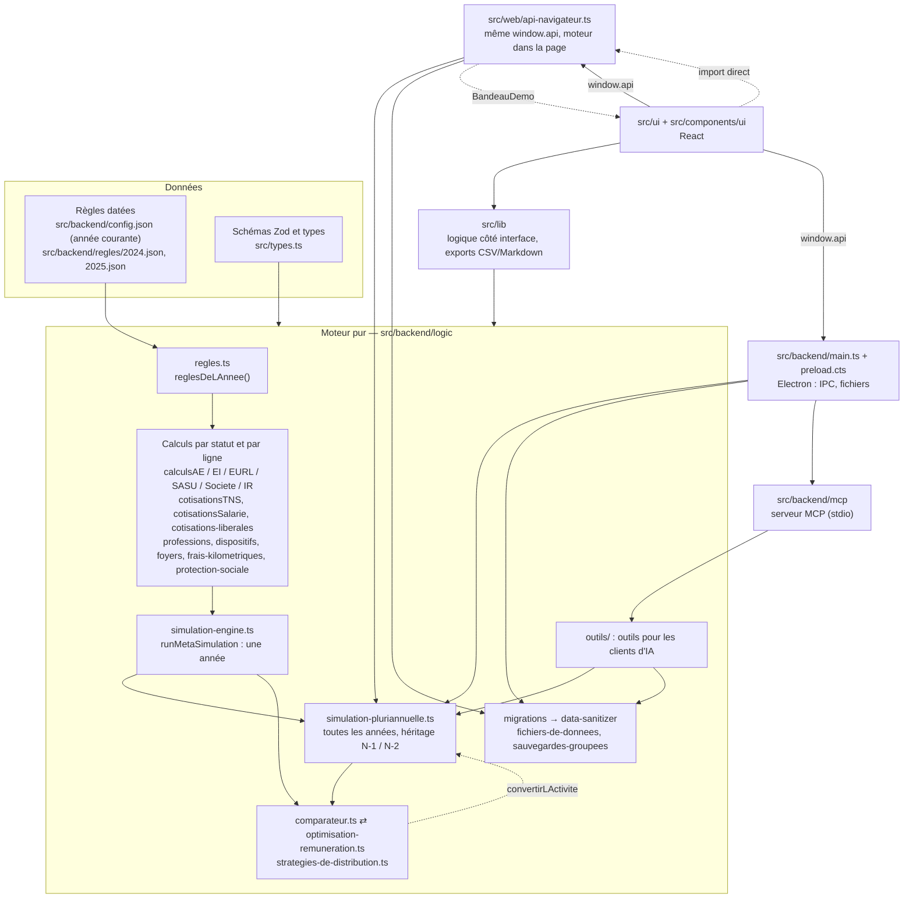

# Relecture du code et de l'architecture — octobre 2026

Point 8 des « Travaux transverses » de la [roadmap](../Roadmap.md). Relecture faite sur `integration` (commit `7c75752`, version 0.10.0), **avant toute correction** : ce document constate et propose ; les corrections viendront par petites branches, après validation.

Objectif vérifiable rappelé : un développeur TypeScript qui découvre le projet ajoute les règles de 2027 et une nouvelle caisse de libéraux en suivant seulement la documentation du dépôt et les tests.

## Sommaire

1. [Résumé](#1-résumé)
2. [Architecture réelle](#2-architecture-réelle)
3. [Mesures avant correction](#3-mesures-avant-correction)
4. [Constats](#4-constats)
5. [Test « sans aide extérieure » : six procédures](#5-test--sans-aide-extérieure---six-procédures)
6. [Plan de correction](#6-plan-de-correction)
7. [Grille de relecture d'une phase](#7-grille-de-relecture-dune-phase)
8. [Méthode et commandes](#8-méthode-et-commandes)

---

## 1. Résumé

**État général : bon socle, documentation de maintenance en retard sur le code.** Le moteur est pur (il ne dépend que des types et des règles), les règles sont des données datées et sourcées, les tests se lisent comme les règles qu'ils vérifient (1 953 tests, 99 % des lignes de la logique couvertes, cas de référence dérivés à la main), sans `any`, sans duplication détectée, sans erreur ESLint ni de type. Mais l'objectif « sans aide extérieure » **n'est pas atteint aujourd'hui** : le guide du développeur (75 lignes, de novembre 2025) décrit une architecture qui n'existe plus et ne contient aucune procédure, et deux des six procédures testées (année 2027, nouvelle caisse) butent sur des pièges que rien ne signale.

**Les 5 risques principaux pour la maintenance :**

1. **Passer à 2027 désactive tous les cas de référence.** Ils sont liés à « l'année en cours » (`config.json`) et non à 2026 : changer d'année les saute en bloc (≈ 150 tests), et une année de règles s'écrit à deux endroits différents (`config.json` pour la courante, `regles/<N>.json` pour les autres), contrairement à ce qu'annonçait l'ADR 007.
2. **Une troisième caisse serait calculée comme la CARPIMKO, sans erreur.** Le code des caisses est écrit en « si CIPAV, sinon CARPIMKO » à plusieurs endroits ; rien n'oblige le compilateur à signaler un cas oublié.
3. **Des règles de l'année en cours utilisées par défaut.** Une quinzaine de fonctions du moteur et de l'interface prennent `regles = reglesEnVigueur` par défaut : un appel qui oublie l'année calcule silencieusement avec celles de 2026 (déjà le cas pour la ligne d'information sous le choix de la profession).
4. **« L'année en cours » est écrite en dur à huit endroits** (`ANNEE_PAR_DEFAUT`, `ANNEE_DES_CAS`, `ANNEE_DES_MONTAGES`, textes « règles 2026 », montants 2026 dans les montages types…), et des taux ou montants des règles sont recopiés dans des textes de l'interface.
5. **Documentation d'architecture périmée ou contradictoire** : guide du développeur muet sur le moteur et en partie faux, ADR 005 (« pas de migration ») contredite par `migrations.ts`, ADR 007 (« `config.json` deviendra `regles/2026.json` ») non appliquée, ADR 004 qui décrit un mécanisme disparu.

Hors maintenance, mais urgent : **un fichier de sauvegardes ou de session abîmé peut être écrasé sans copie** (P1, P2), et « Sauvegarde réussie ! » s'affiche même quand l'écriture échoue (P3).

---

## 2. Architecture réelle

### 2.1 Couches et sens des dépendances

Mesuré par un script qui lit les `import` de `src/` (hors tests) :



**Ce qui est sain (vérifié) :**

- Le moteur (`src/backend/logic`, hors `outils/` et `testing/`) n'importe que `src/types.ts` et les fichiers de règles. Aucune dépendance vers React, Electron, Node (`fs`, `path`) ni vers `src/lib` ou `src/ui`. Les seuls paquets externes du moteur sont `zod` (outils pour les IA).
- Les règles sont des données : aucun taux ni barème fiscal n'est écrit en dur dans les calculs (seuls des choix de modélisation le sont : précision des dichotomies, capital par défaut ; voir § 4).
- Le moteur tourne à l'identique dans le processus principal d'Electron (IPC `simulerLesAnnees`, `compareStatuts`, `optimiserRemuneration`, `comparerStrategies`) et dans la page pour la démo web (`src/web/api-navigateur.ts`, même interface `window.api`).

**Écarts et dépendances à revoir :**

| Dépendance | Constat | Gravité |
|---|---|---|
| `comparateur.ts` ⇄ `optimisation-remuneration.ts` | Cycle d'import, assumé dans un commentaire (`optimisation-remuneration.ts:18`). Il fonctionne (fonctions appelées à l'exécution), mais oblige à lire les deux fichiers ensemble. | basse |
| `simulation-pluriannuelle.ts` → `comparateur.ts` (`convertirLActivite`, `activiteComparee`) | Le cœur pluriannuel dépend du comparateur pour simuler au réel une micro-entreprise sortie du régime. La conversion de statut est une brique du moteur, pas du comparateur. | moyenne |
| `src/ui` ⇄ `src/web` | `App.tsx`, `SettingsSheet.tsx`, `UtiliserAvecUneIA.tsx`, `main.tsx` importent `src/web` ; `src/web/BandeauDemo.tsx` importe `src/ui/components/UtiliserAvecUneIA`. Cycle entre l'application et la démo. | basse |
| `src/lib/relecture-de-proposition.ts`, `src/ui` → `src/backend/mcp/proposition-en-attente.ts` | Type `PropositionRecue` rangé dans le dossier du serveur MCP alors qu'il appartient au contrat entre la boîte aux propositions et l'interface. | basse |
| `src/lib/professions.ts` → `reglesEnVigueur` | La couche interface lit les règles de l'année courante au lieu de celles de l'année affichée. | moyenne |

### 2.2 Flux de données réel

```text
Fichier (session, sauvegardes, export)          Saisie dans l'interface
        │                                                │
        ▼                                                ▼
migrations.ts (format 1 → 2 → 3, notes)          useSessionManager (état, annuler/rétablir,
        │                                         sauvegarde décalée) → window.api
        ▼                                                │
data-sanitizer.ts (Zod élément par élément,              │
  orphelins, professions inconnues, années)              │
        │                                                │
        └──────────────► SessionState ◄──────────────────┘
                              │  window.api.simulerLesAnnees (IPC Electron, ou dans la page en démo web)
                              ▼
simulation-pluriannuelle.ts : pour chaque année de la session, dans l'ordre
   reglesDeLAnnee(N) ─ règles de N, dernières connues + avertissement, ou erreur avant 2024
   héritage : RFR de N-2 (versement libératoire), assiette de N-1 (CARPIMKO),
              régime micro (sorties, retours), réserves et déficits des sociétés (ADR 014)
                              │
                              ▼
simulation-engine.ts : une année → activités (micro, EI, SASU/EURL) → revenus des personnes
                       → foyers (IR, dividendes, RFR) → bilan
                              │
          ┌───────────────────┼────────────────────────────┐
          ▼                   ▼                            ▼
comparateur / optimiseur   interface (ResultsPanel,     outils pour les IA (outils/*)
(une année, relance le     SyntheseDesAnnees…)          → serveur MCP (stdio)
 moteur par colonne)       exports CSV / Markdown / PDF  → boîte aux propositions
```

### 2.3 Écarts avec le guide du développeur et les ADR

**Guide du développeur (`documentation/GUIDE_DEVELOPPEUR.md`)** : à réécrire. Il date de la première version et ne parle ni des règles, ni des années, ni du comparateur, ni des outils pour les IA, ni des tests.

- Il présente `monthlyData` comme une grille unique de la session : depuis l'ADR 008 (format 3), chaque année de `annees` a sa grille.
- Il décrit les fichiers `calculs*.ts` comme « une fonction pure par fichier » : vrai, mais le point d'entrée du moteur (`simulation-engine.ts`, `simulation-pluriannuelle.ts`) n'est pas cité.
- Le flux de sauvegarde décrit (§ 3) cite des noms qui existent encore (`handleSave`, `saveAllSlots`, `writeSlotsToFile`, `show-notification`), mais : il n'y a pas d'`ipcMain.handle('saveSlots')` littéral (enveloppe `ipcMainHandle` de `util.ts:17`, qui vérifie la fenêtre émettrice) ; les sauvegardes sont filtrées par `sauvegardesAEcrire` avant écriture ; la notification part même quand l'écriture échoue (P3).
- « Tous les types découlent de Zod » est inexact : une trentaine de types et d'interfaces de `types.ts` (résultats du moteur) sont écrits à la main ; seuls les types enregistrés viennent de `z.infer`.
- « Utilisez toujours `entity-factory` » n'est pas respecté par `outils/operations.ts` (qui ne peut pas importer `src/lib`).
- Le guide ignore la démo web (moteur dans la page), le serveur MCP (processus à part), les outils pour les IA et les règles JSON.
- Aucune des procédures demandées par la roadmap (année, paramètre, caisse, format de fichier, cas de référence, débogage) n'y figure.

**ADR :**

| ADR | Toujours vraie ? | À faire |
|---|---|---|
| 001 Stack | Oui. | Rien. |
| 002 Persistance locale | En partie. Faux : « le data-sanitizer peut récupérer un fichier partiellement corrompu » (un JSON tronqué échoue avant lui, P1-P2). Non mentionnés : copies `.format-N`, reprise de l'ancien dossier de données. | Mettre à jour avec P1-P4. |
| 003 IPC sécurisée | Le principe tient ; « le renderer est sandboxé » ne repose que sur les valeurs par défaut d'Electron (P7). Non décrits : `validateEventFrame`, le canal synchrone de fermeture, les événements poussés, `setWindowOpenHandler`. | Compléter ; écrire les options (P7). |
| 004 État côté client | **§ 2 faux** : `sessionForSaving` n'existe pas ; `useDebouncedSave` observe `history.present`. Manquent l'enregistrement synchrone à la fermeture, les réglages du comparateur hors historique (ADR 009), les préférences. | Réécrire le § 2. |
| 005 Pérennité et nettoyage | **En partie remplacée.** Elle dit « supprime le besoin de scripts de migration » ; `migrations.ts` (formats 1 → 2 → 3) existe depuis la refonte du moteur et l'ADR 008. | Ajouter un statut « Complétée par l'ADR 008 » et une section « Versionnage du format » : quand changer le numéro (changement de sens, déplacement de données) et quand ne pas le changer (champ facultatif avec valeur par défaut, ADR 009 et 015). |
| 006 Grille annuelle | Oui, mais son titre interne est « ADR-001 ». La « liaison automatique » citée comme manquante a été résolue par le routage des relations dans le moteur. | Corriger le titre ; ajouter une note. |
| 007 Convention d'année | La convention est appliquée ; la partie « Intégration (phase 13) … `config.json` deviendra `regles/2026.json` » **ne l'est pas**, et la « À faire » sur la description de `config.json` est faite. | Décider (voir § 6, branche 1) puis mettre l'ADR à jour. |
| 008 Plusieurs années | Oui. | Rien. |
| 009 Réglages du comparateur | Oui. | Rien. |
| 010 Outils pour les IA | Vrai sur le fond. Le corps parle encore de « quinze outils » (16 avec `rafraichir_proposition`, ajouté par l'addendum) et d'`outputSchema` (retiré par l'addendum) ; l'assistant intégré (étape 3) n'existe pas. | Intégrer l'addendum dans le corps. |
| 011 Serveur MCP | Vrai (l'addendum remplace bien le schéma de sortie). | Rien. |
| 012 Démo installable | Vrai ; tous les fichiers cités existent. | Rien. |
| 013 MCP et Microsoft Store | Conforme au code ; statut encore « Proposé ». | Trancher après l'essai sur un paquet installé. |
| 014 Bénéfice en réserve | Oui. | Rien. |
| 015 Libéraux réglementés | Oui ; ses « À vérifier » restent ouverts. | Ajouter une section « Ajouter une caisse » ou la renvoyer au guide. |

---

## 3. Mesures avant correction

Mesures prises le 9 octobre 2026 sur `integration` (code identique à `a93b82c`). Les seuils « stricts » sont ceux de la relecture, plus bas que la configuration du projet, appliqués en lecture seule.

| Mesure | Valeur | Commentaire |
|---|---|---|
| Lignes de code (SonarQube, `ncloc`) | 18 566 | dont `src/types.ts` 948 lignes, `simulation-engine.ts` 743 |
| Fichiers de plus de 400 lignes utiles (hors tests) | 4 | `simulation-engine.ts` (556), `types.ts` (545), `ResultsPanel.tsx` (459), `main.ts` (418) |
| ESLint, configuration du projet (complexité ≤ 15) | 0 erreur, 1 avertissement | `react-refresh/only-export-components` dans `src/components/ui/button.tsx` (composant shadcn, à garder) |
| Complexité cyclomatique > 10 | 24 fonctions (23 hors tests) | 7 sont exactement à 15, la limite bloquante : `entiteCible`, `comparerStatuts`, `App`, `ComparatorPanel`, `FlowItem`… |
| Fonctions de plus de 80 lignes | 43 (9 hors tests) | `MonthlyGrid` 281, `App` 252, `useSessionManager` 168, `SettingsSheet` 166, gestionnaires IPC de `main.ts` 156, `EditEntityModal` 143, `FlowItem` 132, `NewFlowItem` 119, `MonthlyFlowsModal` 88 |
| Imbrication > 3 niveaux | 0 | |
| Fonctions à plus de 4 paramètres | 24 (22 hors tests) | dont 9 dans `comparateur.ts` (jusqu'à 7 paramètres) |
| Assertions non nulles `!` | 216 (12 hors tests) | presque toutes dans les tests |
| `any`, `@ts-ignore`, `eslint-disable` | 0 | |
| Conversions de type `as X` (hors tests, hors `as const`) | ≈ 46 | la plupart justifiées (`Object.fromEntries`, erreurs Node) ; voir § 4 |
| Duplication (`npm run duplication`, jscpd, 70 jetons) | 0 clone | règles et tests exclus de la mesure |
| Tests (`npm run test:coverage`) | 142 fichiers, 1 953 réussis, 1 ignoré | 20 s |
| Couverture de la logique | instructions 99,02 %, branches 95,46 %, fonctions 98,8 %, lignes 99,67 % | seuils bloquants à 90 % ; SonarQube : 96,9 % |
| Types (`tsc -b`) | 0 erreur | |
| SonarQube Cloud (main) | 372 remarques « code smell », 0 bogue, 0 vulnérabilité, 0 point sensible ; notes A ; dette 2 077 min (≈ 35 h) ; complexité cognitive 2 441 | détail ci-dessous |
| `npm outdated` | 34 paquets en retard | majeures : eslint 10, vite 8, vitest 5, typescript 7, @vitejs/plugin-react 6, lucide-react 1, eslint-plugin-react-hooks 7, globals 17, jscpd 5, cross-env 10, globby 16, vite-tsconfig-paths 6 ; mineures : react 19.3, tailwindcss 4.3, radix, electron 44.7, playwright 1.64 |
| `npm audit --omit=dev` | 2 (1 élevée, 1 modérée) | `source-map-js` (via vite/postcss, compilation seulement) ; `qs` (via `@modelcontextprotocol/sdk` → express, non utilisé : le serveur est en stdio) |
| `npm audit` complet | 19 (9 élevées, 10 modérées) | chaîne d'electron-builder (`sprintf-js`, `@electron/get`…), outils de développement |

**SonarQube, par règle** (372) : S6759 « props en lecture seule » 155 ; S7503 « fonction async sans await » 37 ; S4624 « gabarits imbriqués » 22 ; S3358 « ternaires imbriqués » 17 ; S6819 « `<output>` plutôt que `role=status` » 14 ; S6479 « index comme clé React » 14 ; S7755 « `.at()` » 13 ; S7773 « `Number.parseFloat` » 12 ; S7718 « nom du paramètre de `catch` » 12 ; S1874 « API dépréciée » 7 (`Server` du SDK MCP, icône `Github` de lucide, `flatten()` de Zod) ; S8786 « expression régulière à retour arrière » 6 ; S8783 « clic forcé dans Playwright » 6 ; autres ≤ 5.

**SonarQube, par fichier** : `ResultsPanel.tsx` 24, `ui/testing/setup.ts` 18, `web/api-navigateur.ts` 17, `ComparatorPanel.tsx` 14, `export-markdown.ts` 12, `main.ts` 12, `RemunerationOptimizer.tsx` 12, `DialogueDAvis.tsx` 11.

**Sévères** : 1 bloquante (`e2e/preferences.e2e.ts:46`, « test sans assertion » : faux positif, l'assertion est un `expect.poll`) ; 6 critiques : complexité cognitive de `detailDeLActeur` (`export-markdown.ts:75`, 17) et d'une fonction de `App.tsx:129` (16), boucle de `graduations` (`graphique.ts:12`), trois méthodes vides d'un `ResizeObserver` simulé (`ui/testing/setup.ts:45-47`, voulues).

---

## 4. Constats

Gravité : **haute** (risque d'erreur de calcul ou blocage d'une évolution prévue), **moyenne** (ralentit ou trompe un mainteneur), **basse** (confort). Effort : **S** (moins d'une heure), **M** (une demi-journée), **L** (une journée ou plus).

### 4.1 À corriger

| # | Où | Constat | Grav. | Effort | Proposition |
|---|---|---|---|---|---|
| C1 | `src/backend/logic/testing/cas-de-reference.ts:15-33` | Les cas de référence tournent avec `reglesEnVigueur` (`config.json`) et se désactivent dès que `config.json` change d'année (`describe.runIf`). Ajouter 2027 saute ≈ 150 tests dérivés à la main, alors que les règles de 2026 resteront valables pour simuler 2026. | haute | M | Lier chaque cas à son année : `simuler(…)` prend les règles de `reglesDeLAnnee(2026)` et le rapport de l'année 2026 ; `casDeReference(2026, titre, corps)`. Les cas 2026 restent actifs pour toujours ; seule la mise à jour de l'impôt sur le revenu de 2026 (loi de finances pour 2027) peut en changer quelques-uns, ce qui est voulu. |
| C2 | `src/backend/logic/regles.ts:4-6, 175, 232-246` ; ADR 007 | Deux statuts pour une année de règles : l'année courante vit dans `config.json` (exportée comme `reglesEnVigueur`), les autres dans `regles/<N>.json`. Le commentaire « changer d'année ne demande aucune modification du code » est faux (imports, carte des années, tests). | haute | M | Appliquer l'ADR 007 : `config.json` → `regles/2026.json` ; une liste unique des fichiers (`regles/index.ts` ou `import.meta.glob` côté Vite, liste explicite côté Node) ; `reglesEnVigueur` remplacé par `reglesDeLAnnee(DERNIERE_ANNEE_DES_REGLES)` là où il le faut. |
| C3 | `src/backend/logic/cotisations-liberales.ts:94-113` ; `src/lib/professions.ts:35-56` ; `src/backend/logic/professions.ts:165, 182, 189` | Les caisses sont traitées par « si CIPAV, sinon CARPIMKO » : une troisième caisse ajoutée à `CAISSES_LIBERALES` serait calculée et décrite comme la CARPIMKO, sans erreur de compilation. | haute | M | Une table `Record<CaisseLiberale, CalculDeLaCaisse>` (cotisations, description, particularités micro, assiette de l'année précédente) : le compilateur exige alors chaque caisse. Un test qui parcourt `CAISSES_LIBERALES` et vérifie que chaque profession de chaque fichier de règles a une caisse calculée. |
| C4 | `src/backend/logic/regles.ts:69` ; `src/types.ts:512, 535` | `ProfessionReglementee.caisse` est un `string` (conversion `as CaisseLiberale` dans `professions.ts:33`) et `types.ts` répète l'union littérale `"CIPAV" \| "CARPIMKO"` au lieu de `CaisseLiberale`. | moyenne | S | Typer `caisse: CaisseLiberale \| null` (le JSON est vérifié par le test de forme) et réutiliser `CaisseLiberale` dans `types.ts` (en déplaçant `CAISSES_LIBERALES` dans `types.ts` pour éviter que les types dépendent du moteur). |
| C5 | `calculsAE.ts:53, 122, 130`, `calculsEI.ts:32`, `calculsEURL.ts:29`, `calculsIR.ts:32`, `calculsSASU.ts:14`, `comparateur.ts:317, 323, 365, 419`, `optimisation-remuneration.ts:50`, `simulation-engine.ts:722`, `src/lib/professions.ts:24, 46, 60, 68, 91` | Paramètre par défaut `regles = reglesEnVigueur` : un appel qui oublie les règles calcule avec celles de l'année courante, sans erreur. Déjà visible : la ligne d'information sous le choix de la profession (`ChampProfession.tsx:18, 52, 56`) décrit les taux de 2026 quelle que soit l'année affichée. | haute | M | Rendre `regles` obligatoire dans le moteur ; les tests passent `reglesDeTest` ou `reglesDeLAnnee(N)` explicitement ; l'interface passe les règles de l'année affichée. |
| C6 | `src/backend/logic/outils/operations.ts:62` | La vérification « part conventionnée » d'une proposition lit `reglesEnVigueur`, pas les règles de l'année visée. | basse | S | Passer par `professionsConnues()` et une profession conventionnable dans au moins une année, ou par l'année de la proposition. |
| C7 | `src/types.ts:207`, `src/lib/montages/construction.ts:7`, `cas-de-reference.ts:15`, `src/web/session-exemple.ts:40-43`, `src/web/BandeauDemo.tsx:43`, `src/web/pwa/manifeste.ts:34`, `src/ui/components/MontagesTypes.tsx:99` | « L'année courante » est écrite en dur sous plusieurs noms (`ANNEE_PAR_DEFAUT`, `ANNEE_DES_MONTAGES`, `ANNEE_DES_CAS`, « règles 2026 » dans trois textes). À l'inverse, `ANNEE_DES_SESSIONS_D_UNE_ANNEE = 2026` (`migrations.ts:18`) ne doit **jamais** changer : un remplacement global de « 2026 » le casserait. | moyenne | S | Une seule constante dérivée (`ANNEE_COURANTE = DERNIERE_ANNEE_DES_REGLES`), utilisée par les textes ; un commentaire « valeur historique, ne pas modifier » sur `ANNEE_DES_SESSIONS_D_UNE_ANNEE`. Décision à prendre pour les cas de référence et les montages (voir § 6). |
| C8 | `src/lib/montages/montages.ts:61, 74, 79, 198, 297` | Montants et taux des règles 2026 recopiés dans des textes (« 83 600 € », « 25,6 % », « 29 315 € par part »). Ils deviendront faux en silence. | moyenne | S | Les construire à partir de `reglesDeLAnnee(ANNEE_DES_MONTAGES)` (comme le fait déjà `informationSurLaProfession`), ou les vérifier par un test qui compare le texte aux règles. |
| C9 | `src/ui/components/ChampsDeLActeur.tsx:146, 155` ; `ChampsFrais.tsx:60, 129, 131` ; `cotisationsTNS.ts:119` ; `lib/export-commun.ts:111`, `lib/export-csv.ts:101`, `lib/export-markdown.ts:237-238`, `outils/resultats.ts:224`, `outils/lecture.ts:165`, `outils/commun.ts:77` | Valeurs des règles recopiées dans des libellés : « 10 % du capital », « 5 % du bénéfice », « + 20 % » (électrique), « déduction de 10 % », « valident 3 trimestres ». | moyenne | M | Libellés calculés à partir des règles de l'année affichée (une petite fonction `pourcentage(regles.reserveLegale.partDuBenefice)`) ; « 4 trimestres » (maximum légal par an) peut rester en dur. |
| C10 | `src/lib/salary-utils.ts:4` ; `NewFlowItem.tsx:37, 52, 134` ; `MonthlyFlowsModal.tsx:172` | Le brut d'un salaire extérieur est estimé à 78 % du net (constante hors des règles, texte répété trois fois), alors que le moteur sait retrouver le brut d'un salarié par les vraies cotisations (`brutPourUnNet`). Deux méthodes pour la même notion. | moyenne | M | Décision du propriétaire : soit documenter le 78 % comme hypothèse d'interface (une seule constante, textes construits avec elle), soit proposer le brut calculé par `brutPourUnNet` avec les règles de l'année. |
| C11 | `src/backend/logic/comparateur.ts:109`, `outils/operations.ts:152-153`, `src/lib/entity-factory.ts:32-33` | Capital social par défaut de 1 000 € écrit à trois endroits. | basse | S | Une constante `CAPITAL_SOCIAL_PAR_DEFAUT` dans `types.ts` (choix de modélisation, pas une règle fiscale), avec la raison. |
| C12 | `src/backend/logic/comparateur.ts` (fonctions `scenario` 7 paramètres, `simulerStatut`, `remunerationEtPart`, `simulerScenario`, `beneficeAvantDividendes`, `colonneAuMeilleurNet` 6 paramètres) ; `optimisation-remuneration.ts:27` (7) | Les mêmes cinq paramètres (`session, source, statut, options, regles, contexte`) circulent de fonction en fonction ; cycle avec `optimisation-remuneration.ts`. | moyenne | M | Un objet `ColonneEtudiee { donnees, source, options, regles, contexte }` ; extraire `simulerScenario`, `remunerationMaximale`, `beneficeAvantDividendes` dans `simulation-d-un-statut.ts`, que le comparateur et l'optimiseur importent tous deux (fin du cycle). Tests existants inchangés. |
| C13 | `src/backend/logic/simulation-pluriannuelle.ts:12, 73-79` | Le cœur pluriannuel importe le comparateur pour convertir une micro-entreprise sortie du régime. | moyenne | S | Déplacer `convertirLActivite` et `activiteComparee` dans `conversion-de-statut.ts`. |
| C14 | `src/backend/logic/simulation-engine.ts` (743 lignes) | Un fichier fait tout : agrégation des flux, salariés, sociétés, EI, micro-entreprise et versement libératoire, frais professionnels, impôt du foyer, bilan. Lisible, mais long à parcourir pour un débogage. | moyenne | M | Le découper sans changer le comportement : `simulation-micro.ts` (micro, VFL, dispositifs), `impot-du-foyer.ts` (frais professionnels, revenus du foyer, `calculerFoyer`), `simulation-engine.ts` garde l'orchestration et le routage. |
| C15 | `simulation-engine.ts:78, 90, 722` ; `foyers.ts` (`buildFoyers`) ; `data-sanitizer.ts` (`keepValidItems`, `isRecord`, `SanitizationResult`) ; `options-du-comparateur.ts` (`defaultComparisonOptions`) ; `types.ts` (`warnings` aux lignes 401, 655, 794, 826, 864, 893 contre `avertissements` ligne 691) | Anglais résiduel dans le moteur, et une même notion sous deux noms (`warnings` / `avertissements`). `runMetaSimulation` ne dit pas ce qu'elle fait (« simuler une année »). | basse | M | Renommer les identifiants de code (pas les clés des fichiers enregistrés : `entities`, `relationships`, `monthlyData`, types de flux restent, c'est le format). Ordre proposé : `runMetaSimulation` → `simulerUneAnnee`, `buildFoyers` → `construireLesFoyers`, `warnings` → `avertissements` dans les résultats (non enregistrés). |
| C16 | `data-sanitizer.ts:48` (`isRecord`) et `migrations.ts:153` (`estObjet`) | Même fonction écrite deux fois sous deux noms. | basse | S | Une seule, dans un petit module partagé. |
| C17 | `simulation-engine.ts:407` | `(ctx.annee.annee ?? ctx.regles.annee)` réécrit ce que fait `anneeSimulee(ctx)`. | basse | S | Appeler `anneeSimulee(ctx)`. |
| C18 | `src/ui/App.tsx:64, 165, 327`, `SettingsSheet.tsx:109`, `FlowLegend.tsx:39, 77` | Commentaires « MODIFICATION : » / « MODIFICATION 2 : » : historique de développement, pas une explication. | basse | S | Les retirer, ou les remplacer par le pourquoi s'il y en a un. |
| C19 | ADR 006 (`006-visualisation-grille-annuelle.md:1`) | Titre « ADR-001 ». | basse | S | « ADR-006 ». |
| C20 | ADR 005 | Contredite par `migrations.ts` (voir § 2.3). | moyenne | S | Mettre l'ADR à jour (statut « complétée »), renvoyer à `migrations.ts` et à l'ADR 008. |
| C21 | `src/backend/mcp/serveur-mcp.ts:7, 128-129` ; `DialogueDAvis.tsx:7, 133` ; `data-sanitizer.ts:151`, `main.ts:255` | API dépréciées : `Server` du SDK MCP (remplacée par `McpServer`), icône `Github` de lucide, `error.flatten()` de Zod 4 (remplacée par `z.flattenError`). | moyenne | M | Une branche par API ; pour le SDK MCP, garder les tests du serveur comme filet. |
| C22 | Dépendances | Majeures en retard (eslint 10, vite 8, vitest 5, typescript 7…) ; `npm audit` signale `source-map-js` et `qs` en production (non atteints à l'exécution). | moyenne | M | Mettre à jour les mineures d'un coup (`npm update` + tests) ; une branche par majeure, en commençant par vitest 5 (couverture), puis vite 8, eslint 10, typescript 7. |
| C23 | Expressions régulières signalées S8786 : `retours.ts:197`, `export-commun.ts:24, 26`, `export-markdown.ts:47`, `salary-utils.ts:28`, `amount-utils.ts:10` | Retour arrière possible sur des entrées longues. Les entrées sont courtes (saisies, agent utilisateur), le risque est faible. | basse | S | Borner la longueur des entrées avant l'expression, ou simplifier l'expression ; sinon marquer « accepté » dans SonarQube avec la raison. |
| C24 | `src/lib/graphique.ts:12` | Boucle `for` dont la condition ne porte pas sur son compteur : boucle infinie si `max` vaut `Infinity` ou si le pas est nul. | basse | S | Garde `Number.isFinite(max)` et un nombre maximal de graduations. |

### 4.2 À documenter

| # | Où | Constat | Grav. | Effort | Proposition |
|---|---|---|---|---|---|
| D1 | `documentation/GUIDE_DEVELOPPEUR.md` | Aucune procédure de maintenance ; architecture d'avant les années, le comparateur et les outils pour les IA. | haute | L | Réécrire le guide : schéma du § 2, carte des dossiers, puis les procédures du § 5 (année, paramètre, caisse, statut, format de fichier, cas de référence, débogage, version), sources officielles et façon de les citer. |
| D2 | `src/backend/regles/regles.test.ts:50-108` | La liste des taux vérifiés entre 0 et 1 (`taux()`) est tenue à la main : un nouveau taux non ajouté n'est pas vérifié, sans alerte. | moyenne | S | Le dire dans la procédure « ajouter un paramètre » ; à terme, déduire les taux du nom des clés (`taux`, `part…`) avec une liste d'exceptions. |
| D3 | `src/backend/logic/testing/regles-de-test.ts:210` | Les règles fictives reprennent les règles **réelles** des libéraux de `config.json` : les tests des caisses changent quand l'année courante change. | moyenne | S | Le dire dans le guide ; mieux, lier explicitement à `reglesDeLAnnee(2026).regles.liberauxReglementes` (avec C1). |
| D4 | `src/backend/logic/` (31 modules à plat) | Aucune carte des modules : où est l'IR, où sont les cotisations, qui appelle qui. | moyenne | S | Une table « module → rôle → appelé par » dans le guide, plutôt qu'un déplacement de fichiers (qui casserait l'historique sans gain immédiat). |
| D5 | Conventions de nommage | Le code mêle français (règle du projet) et anglais hérité ; les clés du format de fichier sont en anglais et doivent le rester. | basse | S | Écrire la règle : identifiants nouveaux en français ; clés enregistrées (format de fichier) et noms d'IPC existants inchangés sauf migration. |
| D6 | `documentation/publication.md:21` | Renvoie à l'ADR 005 pour le numéro de format ; c'est `migrations.ts` et l'ADR 008 qui le décrivent. | basse | S | Corriger le renvoi. |
| D7 | Débogage d'un calcul | Les outils existent (export Markdown détaillé, détail des cotisations dans les cartes, rapport `SimulationReport`, cas de référence, scénarios de test du bouton « Tests »), mais rien ne dit comment s'en servir pour un calcul signalé faux. | haute | M | Procédure du § 5 (e), avec un modèle de test « fichier de l'utilisateur → rapport → ligne à vérifier ». |

### 4.3 Interface, outils pour les IA, serveur MCP, persistance

**À corriger**

| # | Où | Constat | Grav. | Effort | Proposition |
|---|---|---|---|---|---|
| P1 | `src/backend/main.ts:206-209` | Un `simulationSlots.json` illisible (JSON tronqué) tombe dans un `catch` muet : la lecture rend `[]`, sans message ni copie ; la sauvegarde suivante écrase le fichier et **toutes les sauvegardes sont perdues**. | haute | S | Distinguer « fichier absent » (`ENOENT`) du reste ; sinon garder une copie (`keepCopy`, suffixe `refuse`) et prévenir, comme `readPrefsFromFile` (`main.ts:226-237`). |
| P2 | `main.ts:136-151` | Session illisible : l'utilisateur est prévenu, mais aucune copie n'est gardée (seul le refus pour cause d'années en garde une) ; la sauvegarde différée réécrit `sessionState.json` une seconde plus tard. Commentaire « (BONUS) » ligne 144. | haute | S | `keepCopy(…, "refuse")` avant de repartir d'une session vierge ; texte du message qui cite la copie. |
| P3 | `main.ts:212-219, 383-393` ; `src/web/api-navigateur.ts:101-103`, `src/web/stockage-navigateur.ts:184-191` | `writeSlotsToFile` avale l'erreur et le canal affiche quand même « Sauvegarde réussie ! » ; même chose dans la démo (quota dépassé avalé). | haute | S | Faire remonter l'échec, notifier une erreur, rejeter la promesse. |
| P4 | `main.ts:155-157, 361-370` | Session écrite sans fichier temporaire, en asynchrone puis en synchrone à la fermeture : deux écritures peuvent s'entrelacer. Les préférences et la copie du serveur MCP passent déjà par un fichier temporaire renommé. | moyenne | S | Un utilitaire `ecrireAtomiquement` pour la session, les sauvegardes et les préférences. |
| P5 | `src/lib/session-service.ts:39-41, 63-65` | `void window.api.saveSlots(…)`, `void window.api.exportState(…)` : un rejet n'est pas géré et le panneau se ferme comme si tout avait réussi. | moyenne | S | Rendre la promesse et l'attendre dans `SettingsSheet`. |
| P6 | `src/ui/hooks/useSessionManager.ts:75`, `useDebouncedSave.ts:11-19` | La sauvegarde automatique est gardée par « premier rendu » et non par `isLoaded` : en `StrictMode`, ou si le chargement échoue, la session vierge peut être sauvegardée par-dessus le fichier. | moyenne | S | Ne rien sauvegarder avant `isLoaded`. |
| P7 | `main.ts:308-312`, `util.ts:18` | `contextIsolation`, `sandbox`, `nodeIntegration` non écrits (sûrs par défaut dans Electron 44, mais rien ne les fige) ; pas de garde `will-navigate` ; `validateEventFrame` sauté si `senderFrame` est nul. | moyenne | S | Écrire les trois options, bloquer la navigation hors développement, refuser un appel sans cadre émetteur. |
| P8 | `main.ts:357, 364, 374-375, 396, 414-416` | Entrées IPC non validées : session écrite sans `SessionStateSchema`, `options` et `annee` des calculs, `exportState`, `format` inconnu. | basse | S | Schémas Zod aux frontières, comme pour la session des calculs. |
| P9 | `src/ui/App.tsx:128-150` | Le raccourci global Ctrl+Z / Ctrl+Y intercepte la frappe dans les champs : l'annulation du champ est remplacée par celle de la session ; `navigator.platform` déprécié. | moyenne | S | Ignorer `input`, `textarea`, `contentEditable` ; sortir le code dans un hook testé. |
| P10 | `src/ui/components/SettingsSheet.tsx:1-11, 109-181` | L'en-tête annonce un composant « sans logique métier » qui contient toute la logique de sauvegarde (mise à jour, « sauvegarder sous », écrasement) ; commentaires « ENTIÈREMENT RÉÉCRITE », « ACTION CRUCIALE ». | moyenne | M | Fonction pure `enregistrerLaSession(slots, session, idChargee)` dans `session-service.ts`, testée ; en-tête réécrit. |
| P11 | `MonthlyGrid.tsx:172-259` (281 lignes au total), `App.tsx:181-194` | Calculs de la grille (échelles, segments, totaux) et numérotation des types de flux dans les composants ; mois en double avec `MOIS` de `export-commun.ts:15`. | moyenne | M | `donneesDeLaGrille(…)` dans `src/lib`, testée. |
| P12 | `main.ts:352-539` | Un seul bloc `app.on("ready")` d'environ 190 lignes, 17 canaux. | moyenne | M | Découper par domaine (session, fichiers, MCP) ; messages de boîtes de dialogue en fonctions pures testées. |
| P13 | `main.ts` / `src/web/api-navigateur.ts` | Persistance écrite deux fois : la démo saute les migrations des sauvegardes (`getSaveSlots`, l. 99), ne contrôle pas `statut` (l. 93), et une session abîmée y est remplacée par la session d'exemple (`stockage-navigateur.ts:175-182`, `api-navigateur.ts:85-86`). | moyenne | M | Un noyau commun du pont, paramétré par le stockage (disque ou navigateur). |
| P14 | `ResultsPanel.tsx:20`, `ComparatorPanel.tsx:42`, `ReglagesDuComparateur.tsx:19`, `RepartitionBenefice.tsx:15`, `export-markdown.ts:38`, `logic/format.ts:4` | Six formateurs d'euros. | basse | S | Un seul module de formatage. |
| P15 | `ResultsPanel.tsx:176, 178`, `export-markdown.ts:232-238`, `export-csv.ts:101`, `outils/commun.ts:77`, `outils/lecture.ts:165`, `outils/resultats.ts:224` | « Déduction de 10 % » écrite en dur (règle `IR.abattementSalaires.taux`). Complète C9. | moyenne | S | Lire le taux dans les règles de l'année. |
| P16 | `src/backend/logic/outils/operations.ts:150-154` ; `EditEntityModal.tsx:41-42` ; `session-service.ts:6-12` | Cinq `as Entity` qui contournent le typage ; `JSON.parse(JSON.stringify(…))` qui rend `any` ; deuxième déclaration de `window.api` (déjà dans `src/globals.d.ts:49-53`). | moyenne | S | `satisfies` ou validation par le schéma ; `structuredClone` ; supprimer la déclaration en double. |
| P17 | `src/ui` ⇄ `src/web` (voir § 2.1) | Cycle entre l'application et la démo ; la version de bureau dépend de l'élimination du code mort autour de `VITE_CIBLE`. | moyenne | M | `main.tsx` racine de composition (contexte « plateforme » qui fournit bandeau, bouton d'installation, liens) ; `FenetreIADeLaDemo` dans `src/web` ; règle ESLint `import/no-restricted-paths` pour figer les sens de dépendance. |
| P18 | Commentaires | `App.tsx:64-65, 152-153, 165-166, 327-329` (au-dessus du mauvais composant), `343, 351` ; `main.ts:14` (import doublé), `158-164` (code commenté), `499-500` ; `util.ts:1`, `preload.cts:1` (chemin `src/electron/…` inexistant), `util.ts:9` (« VERSION DÉFINITIVE - ZÉRO 'any' ») ; `globals.d.ts:6` ; `MonthlyGrid.tsx:333` ; `RepartitionBenefice.tsx:234-237` (JSDoc orphelin) ; `business-logic.ts:40` (décrit `fromId` seul, le code teste `fromId` ou `toId`) ; `outils/catalogue.ts:2-3` (parle d'un assistant intégré qui n'existe pas). | basse | S | Nettoyage, avec C18. |
| P19 | Vocabulaire | « entité » affiché à côté d'« acteur » (`MonthlyGrid.tsx:276, 306`, `EntitiesManager.tsx:78`, `main.ts:117`, `SettingsSheet.tsx:314`) ; canaux IPC mêlés (`getCurrentSession`, `compareStatuts`, `saveSlots` / `simulerLesAnnees`, `ouvrirAdresseExterne`) ; `activityId` / `acteurId`. | basse | M | Glossaire dans le guide ; « acteur » partout à l'écran ; canaux renommés au fil de l'eau (ils ne sont pas enregistrés). |
| P20 | `boite-aux-propositions.ts:148, 198, 186-195` ; `main.ts:534` | Tri par `localeCompare` alors que `mcp/donnees.ts:33` impose l'ordre par points de code ; tri écrit deux fois ; si `fs.watch` échoue, `propositionsEnAttente` rend le cache sans relire le dossier. | basse | S | Un tri commun ; relire le dossier à la demande. |
| P21 | Exports inutilisés hors de leur fichier : `catalogue.ts` (`schemaJson`, `JsonSchema`, `DescriptionOutil`, `ReponseOutil`), `commun.ts` (`TYPES_PERMIS`, `TYPES_DE_RELATION_FAMILIALE`), `limites.ts` (`texteCourt`, `MoisSchema`), `serveur-mcp.ts` (`outilsPublies`, `appelerOutil`, `OptionsDuServeur`), `ResultsPanel.tsx` (`NotesDesDispositifs`), `proposition-en-attente.ts` (`PropositionEnAttenteSchema`) | Pas de code réellement mort, mais une surface publique trompeuse. | basse | S | Retirer les `export` ; ajouter `knip` à la CI. |
| P22 | `useSessionManager.ts:11-18, 231` | Les valeurs par défaut d'une session sont réécrites à la main au lieu de `SessionStateSchema.parse({})` (comme `main.ts:57-59`) ; `slotOrder` rendu en double. | basse | S | Utiliser le schéma. |

**À documenter**

- `src/backend/logic` n'est pas un « backend » : c'est un moteur pur partagé par la page, le processus principal, la démo web et le serveur MCP (`App.tsx`, `SettingsSheet.tsx`, `useSessionManager.ts` l'importent directement). Le dire dans le guide ; un renommage (`src/moteur`) pourra venir plus tard.
- `src/backend/mcp/proposition-en-attente.ts` est le contrat partagé par la boîte aux propositions, `src/lib` et l'interface (imports de type seulement) : le documenter, ou le déplacer à côté de `outils/propositions.ts`.
- La contrainte `ELECTRON_RUN_AS_NODE` (ADR 011) n'est rappelée nulle part près de la configuration de construction (`electron-builder.json`).

**À garder tel quel**

- `preload.cts` : pas d'`invoke` générique, API typée par `EventPayloadMapping`, `validateEventFrame` qui compare l'adresse sans le fragment.
- Boîte aux propositions : noms vérifiés, `lstat`, plafond de 512 Ko, `strictObject` ; robuste contre la traversée de chemin.
- Ouverture d'adresses externes : https seulement, revérifiée dans le processus principal (`main.ts:323-326, 460-472`).
- Outils pour les IA : `executerOutil` ne lève jamais, schémas stricts, limites bornées, test d'isolement (`outils/isolement.test.ts`), `console` redirigée vers stderr dans le serveur MCP.
- `readPrefsFromFile` / `writePrefsToFile` (`main.ts:226-249`) : copie du fichier refusé et écriture par fichier temporaire renommé ; c'est le modèle à recopier pour P1 à P4.
- `ANNEE_PAR_DEFAUT` est vérifié égal à `reglesEnVigueur.annee` par `annees.test.ts:28` : le garde-fou existe, la dérivation (C7) reste préférable.

### 4.4 À garder tel quel

| # | Quoi | Raison |
|---|---|---|
| G1 | Règles en JSON avec `description` et `source` pour chaque bloc, et le test de forme `MemeForme` (`regles/regles.test.ts:24-25`) | C'est ce qui rend les règles relisables par un non-développeur et empêche un fichier d'année d'oublier un champ. |
| G2 | Règles fictives aux chiffres ronds pour les tests unitaires (`testing/regles-de-test.ts`) | Les montants attendus se vérifient de tête et ne changent pas chaque année. |
| G3 | Cas de référence avec la dérivation en commentaire (`references/*.reference.test.ts`) | Chaque test se lit comme la règle et le calcul à la main ; c'est le meilleur outil de débogage du dépôt. Seul le rattachement à l'année est à revoir (C1). |
| G4 | Identité du bilan vérifiée dans les cas de référence (`verifierIdentiteDuBilan`) | Garde-fou général contre un montant perdu entre activités, foyers et prélèvements. |
| G5 | Moteur pur exécuté à l'identique dans Electron et dans la démo web | Une seule implémentation, testée une fois. |
| G6 | `migrations.ts` + `data-sanitizer.ts` (migration avant validation, Zod élément par élément, rapport à l'utilisateur, copie du fichier d'origine) | Robuste et testé ; seule la documentation est en retard (C20). |
| G7 | Clés anglaises du format de fichier (`entities`, `relationships`, `monthlyData`, types de flux `ca_services`…) | Les renommer exigerait une migration de format sans bénéfice pour l'utilisateur. |
| G8 | Dichotomies du moteur (`revenuAvantCotisationsPourUnNet`, `remunerationMaximale`, `brutPourUnNet`) | Choix documenté (fonction monotone, précision bien inférieure au centime) ; plus sûr qu'une formule inversée à la main pour chaque barème. |
| G9 | Cycle `comparateur.ts` ⇄ `optimisation-remuneration.ts` en attendant C12 | Il est expliqué en commentaire et ne pose pas de problème d'initialisation. |
| G10 | Avertissement `react-refresh` sur `src/components/ui/button.tsx`, remarques SonarQube sur `ui/testing/setup.ts` (méthodes vides d'un `ResizeObserver` simulé) et bloquante sur `e2e/preferences.e2e.ts:46` (`expect.poll` est une assertion) | Faux positifs ou code de bibliothèque ; à marquer comme acceptés dans SonarQube avec la raison. |
| G11 | S6759 « props en lecture seule » (155 remarques) | Purement stylistique ; à traiter seulement si le propriétaire veut un tableau SonarQube vide (un `Readonly<…>` par composant, mécanique). |
| G12 | Limite de complexité à 15 dans ESLint | Elle a tenu le code ; abaisser à 12 après les découpages de C12, C14 et des gros composants, pas avant. |

---

## 5. Test « sans aide extérieure » : six procédures

Pour chaque procédure : ce que dit la documentation, les fichiers à toucher réellement, ce qui manque. Rien n'a été modifié.

### (a) Ajouter l'année de règles 2027

**La documentation suffit-elle ? Non.** L'ADR 007 donne la convention (quelle valeur prendre pour l'année N) mais décrit une intégration qui n'a pas été faite ; le guide n'en parle pas ; le README dit que les cas de référence « échouent explicitement si `config.json` change d'année », sans dire quoi faire ensuite.

**Fichiers à toucher aujourd'hui :**

1. Décider où va 2027. Deux lectures possibles du code : (i) `config.json` reste « l'année courante » : copier `config.json` dans `regles/2026.json`, écrire 2027 dans `config.json` ; (ii) créer `regles/2027.json` et laisser `config.json` en 2026. Rien ne dit laquelle ; (i) désactive tous les cas de référence (C1), (ii) laisse `reglesEnVigueur` et tous les paramètres par défaut sur 2026 (C5).
2. Le fichier de règles lui-même : chaque bloc, sa `description` et sa `source` (règles de l'ADR 007 : impôt sur le revenu de la loi de finances pour 2028, repris de la dernière connue tant qu'elle n'est pas votée ; cotisations, PASS, SMIC, micro, IS en vigueur pendant 2027 ; changement en cours d'année : valeur du 1er janvier) ; `derniereMiseAJour`.
3. `src/backend/logic/regles.ts:4-6, 242-246` : import et entrée de la carte des années.
4. `src/backend/regles/regles.test.ts:9-32` : import, `formesIdentiques`, liste `annees` ; puis les tests nommés par année (`:414-470` : CIPAV, retraite de base, CARPIMKO, barème kilométrique « de 2024 à 2026 »).
5. `src/backend/logic/testing/cas-de-reference.ts:15` (`ANNEE_DES_CAS`) et les 15 fichiers de `references/` si l'année courante change (C1).
6. `src/backend/logic/testing/regles-de-test.ts:210` (libéraux réels de `config.json`).
7. Années en dur : `src/types.ts:207`, `src/lib/montages/construction.ts:7` et les textes de `montages.ts`, `MontagesTypes.tsx:99`, `BandeauDemo.tsx:43`, `manifeste.ts:34`, `session-exemple.ts`, scénarios de `src/lib/scenarios-de-test.ts`, tests de bout en bout qui attendent des montants (`e2e/`, `e2e-web/` : 20 fichiers citent 2026). **Ne pas toucher** `ANNEE_DES_SESSIONS_D_UNE_ANNEE` (`migrations.ts:18`).
8. L'année précédente : au vote de la loi de finances pour 2027 (février 2027), mettre à jour l'impôt sur le revenu du fichier 2026 (ADR 007, règle 1) et les cas de référence 2026 concernés.
9. `README.md` (« 2024 à 2026 », « barème 2026 »), `CHANGELOG.md`.

**À ajouter au guide :** une procédure « Nouvelle année de règles » en dix étapes, une liste de contrôle des sources par bloc (où trouver PASS, SMIC, barème IR, taux micro, taux CIPAV…), la règle « une année passée ne change plus, sauf la mise à jour de l'impôt sur le revenu au vote de la loi de finances suivante », et la commande qui vérifie (`npx vitest run src/backend/regles src/backend/logic/references`). Après C1, C2 et C7, l'ajout d'une année se réduit à : un fichier JSON, une ligne dans la liste des années, les tests de `regles.test.ts`, la constante de l'année courante.

### (b) Ajouter une caisse de libéraux (exemple : CARMF)

**La documentation suffit-elle ? Non.** L'ADR 015 explique le modèle (profession → caisse, règles de l'année) et le dossier `documentation/recherche/caisses-des-liberaux.md` montre comment documenter une caisse, mais rien ne liste le code à toucher, et le piège C3 n'est signalé nulle part.

**Fichiers à toucher aujourd'hui :**

1. Recherche : un dossier `documentation/recherche/carmf.md` (barèmes, sources, cas calculés à la main), sur le modèle de `caisses-des-liberaux.md` ; une décision (nouvelle ADR ou complément de l'ADR 015) pour ce que le modèle actuel ne sait pas faire (pour les médecins : secteur de conventionnement 1 ou 2, ASV par secteur, classes d'invalidité-décès).
2. `src/backend/logic/regles.ts:58, 102-128` : ajouter `"CARMF"` à `CAISSES_LIBERALES` et un bloc `CARMF` à `ReglesLiberauxReglementes`.
3. **Les trois fichiers de règles** (`regles/2024.json`, `2025.json`, `config.json`) : le test de forme exige le bloc dans chaque année, avec ses `description` et `source` ; plus les professions (médecin…) dans `professions.liste`.
4. `src/backend/logic/cotisations-liberales.ts:94-113` : la branche de la caisse (sinon elle passe par le calcul de la CARPIMKO, C3).
5. `src/backend/logic/professions.ts:165` (assiette de l'année précédente, réservée à la CARPIMKO), `:182, :189` (micro-entreprise propre à la CIPAV), `:201` (texte « praticiens et auxiliaires médicaux »).
6. `src/types.ts:512, 535` (union littérale des caisses, C4) ; si un nouveau champ est saisi (secteur), le schéma de l'activité, `data-sanitizer.ts`, les outils (`outils/operations.ts`), l'interface (`ChampProfession.tsx`) et les exports.
7. `src/backend/logic/protection-sociale.ts:38-40` (description de la couverture par caisse).
8. `src/lib/professions.ts:18, 35-56` (titre du groupe, texte d'information : branche « sinon CARPIMKO »).
9. `src/backend/logic/outils/lecture.ts:186-195` (règles des libéraux exposées aux IA), `outils/operations.ts:63`, `outils/resultats.ts:168-176`.
10. `src/lib/export-markdown.ts:29` (hypothèses : « seules la CIPAV et la CARPIMKO sont calculées »), `README.md:147` (limites).
11. Tests : `regles/regles.test.ts:112-134` (`tauxDesLiberaux`) et `:273-294` (ordre des professions), `cotisations-liberales.test.ts`, `references/liberaux.reference.test.ts` (cas dérivés à la main), `professions.test.ts` (moteur et `src/lib`), `ResultsPanel.liberaux.test.tsx`, `export-liberaux.test.ts`, `src/web/outils-ia-liberaux.test.ts`, `e2e-web/professions.web.ts`.

**À ajouter au guide :** une procédure « Nouvelle caisse » qui suit cette liste, un test d'exhaustivité (chaque caisse de `CAISSES_LIBERALES` a un calcul, une description, un titre de groupe) et, avant tout, la correction C3 pour que le compilateur guide le développeur.

### (c) Ajouter un paramètre aux règles

**La documentation suffit-elle ? En partie.** L'ADR 007 dit comment remplir `description` et `source` ; les tests de forme signalent un fichier oublié. Rien n'est écrit sur le reste.

**Fichiers à toucher :** l'interface TypeScript de `regles.ts` ; les trois fichiers JSON (chaque année : valeur, `description`, `source`) ; `testing/regles-de-test.ts` (le compilateur l'exige) ; `regles/regles.test.ts` : la liste `taux()` si c'est un taux (sinon il n'est pas vérifié entre 0 et 1, D2) et un test de cohérence d'une année à l'autre si utile ; le calcul qui l'utilise et son test unitaire (règles fictives) ; un cas de référence si le montant change ; `outils/lecture.ts` si les IA doivent le voir.

**À ajouter au guide :** cette liste ; la règle « jamais de valeur des règles dans un texte de l'interface » (C9).

### (d) Faire évoluer le format de fichier

**La documentation suffit-elle ? En partie, et elle se contredit.** Le commentaire de tête de `migrations.ts` dit comment ajouter une version ; l'ADR 005 dit qu'il n'y a pas de migration ; les ADR 008, 009 et 015 expliquent au cas par cas quand ne pas changer le numéro. Il faut lire les cinq pour comprendre la règle.

**Fichiers à toucher (changement qui exige un nouveau numéro) :** `src/types.ts` (schémas Zod) ; `migrations.ts` (`FORMAT_VERSION_ACTUEL`, fonction `migrerV3VersV4`, notes à l'utilisateur) et `migrations.test.ts` ; `data-sanitizer.ts` si le nettoyage change ; `sauvegardes-groupees.ts` et `fichiers-de-donnees.ts` si les sauvegardes ou exports changent ; `src/lib/testing/session-maximale.ts` et le test « rien ne se perd » (`src/web/rien-ne-se-perd.test.ts`) ; les outils pour les IA s'ils lisent le champ (`outils/lecture.ts`) ; une ADR.

**À ajouter au guide :** un arbre de décision — champ facultatif avec valeur par défaut : pas de nouveau numéro (une version précédente ignore le champ) ; changement de sens ou déplacement de données : nouveau numéro, migration, notes, copie du fichier d'origine (déjà faite par `main.ts`) ; et la conséquence pour les versions précédentes (elles préviennent puis ignorent ce qu'elles ne connaissent pas).

### (e) Déboguer un calcul signalé faux

**La documentation suffit-elle ? Non.** Les outils sont là, la façon de s'en servir ne l'est pas.

**Ce qu'un développeur doit savoir, et qu'il trouve aujourd'hui seulement en lisant le code :**

1. Demander l'export Markdown de la simulation (menu Exporter) : il contient les hypothèses, le détail des cotisations ligne à ligne et l'impôt du foyer ; ou le fichier de session (Exporter la session).
2. Reproduire dans un test : lire le fichier avec `sanitizeStateAndFillDefaults`, lancer `simulerLesAnnees(session)` et lire `annees[i].report` (`activities[].cotisationsTNS.cotisations`, `cotisationsPresident`, `foyers[].impotSurLeRevenu`…).
3. Retrouver la règle : `reglesDeLAnnee(annee)` et le bloc du fichier JSON, avec sa source.
4. Refaire le calcul à la main, puis l'écrire comme un cas de référence (modèle : `references/liberaux.reference.test.ts`), qui reste après la correction.
5. Vérifier l'identité du bilan (`verifierIdentiteDuBilan`) pour savoir si un montant est perdu entre activités et foyers.

**À ajouter :** cette procédure au guide ; un petit script `npm run simuler -- chemin/session.json [année]` qui imprime le rapport en Markdown (réutilise `export-markdown.ts`), pour déboguer sans écrire de test.

### (f) Publier une version

**La documentation suffit-elle ? Oui.** `documentation/publication.md` est complet (source unique du numéro, liste de vérification, étiquette, workflow, relecture du brouillon, Microsoft Store). Seul défaut : le renvoi à l'ADR 005 pour le numéro de format (D6).

---

## 6. Plan de correction

Des branches courtes, chacune testée et fusionnée dans `integration` avant la suivante. Ordre : d'abord ce qui protège les évolutions prévues (2027, nouvelles caisses), puis la documentation, puis la lisibilité.

| Ordre | Branche | Contenu | Risque | Tests à ajouter ou adapter |
|---|---|---|---|---|
| 0 | `persistance-sure` — **fait** (commit `31822cd`, tests `1ed28c2`) | P1 à P6 : copie et message pour un fichier de sauvegardes ou de session illisible, échec d'écriture remonté et notifié, écriture atomique commune, pas de sauvegarde avant chargement ; mêmes corrections dans la démo web. | faible, mais touche les données des utilisateurs | Tests de bout en bout : fichier de sauvegardes tronqué → copie gardée et message ; écriture impossible → notification d'erreur ; tests unitaires de `useSessionManager` sous `StrictMode`. |
| 1 | `cas-de-reference-dates` — [x] fait (`958646c`) | C1 : les cas de référence prennent explicitement les règles de 2026 et la garde par année devient inutile ; D3 : les règles fictives prennent les libéraux de 2026 explicitement. **Fait :** `REGLES_DES_CAS = reglesPubliees(2026)`, garde retirée, montages types figés sur 2026, test `annee-suivante` (une année 2027 fictive ne change aucun chiffre) ; les cas de `dispositifs.reference.test.ts` qui simulent 2027 et 2028 avec les dernières règles connues changeront, eux, avec les règles de 2027. | faible : mêmes montants attendus | Aucun nouveau ; vérifier que les ≈ 150 cas tournent toujours. |
| 2 | `regles-un-fichier-par-annee` — [x] fait (`f683482`) | C2 : `config.json` → `regles/2026.json`, liste unique des années ; `reglesEnVigueur` remplacé ; ADR 007 mise à jour ; C7 : une seule constante pour l'année courante, commentaire sur la constante historique des migrations. **Fait :** liste `FICHIERS_DE_REGLES` (`src/backend/regles/index.ts`) et `ANNEE_COURANTE` dérivée (la plus récente des années de la liste) ; `ANNEE_PAR_DEFAUT`, la session d'exemple, la démo et les descriptions des outils pour les IA en dérivent ; montages types datés par `ANNEE_DES_MONTAGES` ; `reglesEnVigueur` n'est plus que `reglesPubliees(ANNEE_COURANTE)`, supprimé à la branche 3. | moyen : chargement des règles dans Electron, la démo web et le serveur MCP empaqueté | Test « chaque fichier de `regles/` est chargé, les années se suivent » ; tests de bout en bout et `test:web` complets. |
| 3 | `regles-explicites` — [x] fait (`482372c`) | C5, C6 : paramètre `regles` obligatoire dans le moteur ; l'interface passe les règles de l'année affichée (ligne d'information de la profession). **Fait :** `reglesEnVigueur` supprimé, plus aucune valeur par défaut des règles (moteur et `src/lib`) ; la fenêtre « Modifier » reçoit l'année affichée (`reglesDesProfessions`), l'export Markdown celle de l'année exportée ; la part conventionnée d'une proposition se vérifie sur les règles de chaque année connue. Seul appel qui changeait de résultat : la ligne d'information de la profession (corrigée) ; le libellé de la profession dans l'export Markdown est identique d'une année à l'autre aujourd'hui. | moyen : beaucoup d'appels de tests à compléter | Test de `ChampProfession` sur une année 2025 (taux CIPAV de 2025). |
| 4 | `caisses-exhaustives` — [x] fait (`df83506`) | C3, C4 : table par caisse, typage `CaisseLiberale`, union de `types.ts` dérivée. **Fait :** `CAISSES_LIBERALES` déplacée dans `types.ts`, seule source de `CaisseLiberale` (plus d'union recopiée) ; tables `CALCUL_PAR_CAISSE` (cotisations), `PARTICULARITES_DES_CAISSES` (assiette de l'année précédente, taux micro propre), `INFORMATION_PAR_CAISSE` et `TITRES_DES_CAISSES` (interface), `COUVERTURE_TNS` (déjà exhaustive) ; `ReglesLiberauxReglementes` exige un bloc par caisse. Essai : ajouter « CARMF » à la liste fait échouer la compilation dans chaque table et pour chaque fichier de règles ; un test le simule (`@ts-expect-error`). Reste écrit par caisse, sans risque de calcul faux : les règles exposées aux IA (`outils/lecture.ts`) et le texte des limites de l'export Markdown. `ProfessionReglementee.caisse` reste un `string` (le JSON importé n'a pas de type littéral) : `caisseDe` le ramène à une caisse et un test vérifie chaque fichier. | moyen : touche le calcul des libéraux | Test d'exhaustivité par caisse ; les cas de référence des libéraux restent identiques. |
| 0 bis | `session-refusee-signalee` — [x] fait (`65f21bb`) | Reste de la branche 0 : une session refusée en bloc par le schéma (nom qui n'est pas un texte, grille inutilisable) n'est plus remplacée en silence par une session vierge. **Fait :** `nettoyerLaSession` lève `SessionIrrecuperableError` ; la lecture de la session (bureau et démo web) la traite comme un fichier illisible (copie horodatée, message) ; l'import d'un tel fichier est refusé ; le nettoyage élément par élément ne change pas. ADR 005 complétée. | faible | Tests de `nettoyerLaSession`, de la lecture de la session (bureau, démo) et de l'import. |
| 5 | `guide-du-developpeur` — [x] fait | D1, D2, D4, D5, D6, D7 : guide réécrit avec le schéma du § 2 et les procédures du § 5 ; ADR 005 et 006 corrigées (C19, C20). **Fait :** `documentation/GUIDE_DEVELOPPEUR.md` réécrit (prise en main, architecture, carte du moteur, dix procédures, sources, glossaire) ; chaque procédure suivie réellement dans le dépôt puis annulée. ADR 003, 004, 005, 006, 007, 010 et 015 complétées par une section datée ; renvoi de `publication.md` corrigé (D6). Constats des essais : ajouter 2027 fait échouer une cinquantaine de tests unitaires et une trentaine de tests de bout en bout qui attendent 2026 en dur (session vierge, simulation d'exemple, « dernière année connue ») ; un nouveau statut juridique tombe dans un « sinon » du moteur sans erreur de compilation ; le catalogue des outils pour les IA est à une cinquantaine de caractères de son plafond ; `tsc -b` ne vérifie pas `src/backend` (il faut `transpile:electron` et `typecheck:tests`). | nul (documentation) | — |
| 5 bis | `tests-annee-courante` — [x] fait | Décision 7 : les tests liés à l'année en cours la calculent ; la simulation d'exemple de la démo est figée sur 2026. **Fait :** `ANNEE_DE_L_EXEMPLE = 2026` (`src/web/session-exemple.ts`), commentée comme `ANNEE_DES_MONTAGES` ; session vierge, « dernières règles connues » et année future écrites avec `ANNEE_PAR_DEFAUT`, `ANNEE_COURANTE` et `ANNEE_COURANTE + 1` (aides `e2e-web/support/annees.ts`) ; restent sur 2026 les cas de référence, les montages types, la simulation d'exemple et ses montants, les tests des règles d'une année précise. Essai avec une année 2027 identique à 2026 : 82 échecs avant (51 unitaires, 30 de la démo web, 1 de l'application), 1 après (`regles/regles.test.ts`, que la procédure fait compléter) ; avec des valeurs de 2027 différentes, s'y ajoutent seulement des cas de `dispositifs.reference.test.ts` qui simulent 2027 et 2028. Procédure 3.1 du guide mise à jour. | faible (tests seulement, et l'année de l'exemple) | Aides `e2e-web/support/annees.ts`. |
| 6 | `textes-tires-des-regles` | C8, C9, C10, C11 : libellés et montages construits à partir des règles ; capital par défaut unique ; décision sur les 78 %. | faible | Un test par texte : il contient la valeur des règles de l'année (« 83 600 € » vient de `microEntreprise.plafonds.services`). |
| 7 | `script-simuler` | Le script `npm run simuler` du § 5 (e). | faible | Test du script sur une session de `src/lib/testing`. |
| 8 | `comparateur-allege` | C12, C13 : objet de colonne, module de simulation d'un statut, conversion de statut hors du comparateur ; fin du cycle. | moyen : cœur du comparateur | Aucun nouveau ; tests et cas de référence du comparateur et de l'optimiseur inchangés. |
| 9 | `moteur-decoupe` | C14, C16, C17 : découpage de `simulation-engine.ts`. | faible si déplacement pur | Aucun ; diff relu « déplacement seulement ». |
| 10 | `interface-decoupee` | P9 à P12, P14, P16, P18, P22 : raccourcis clavier, logique de `SettingsSheet` et de `MonthlyGrid` dans `src/lib`, `main.ts` découpé, formateur unique, commentaires « MODIFICATION » retirés (C18). | moyen : interface | Tests des nouvelles fonctions de `src/lib` ; Ctrl+Z dans un champ texte ; tests de bout en bout. |
| 10 bis | `electron-durci` | P7, P8 : options de sécurité écrites, navigation bloquée, entrées IPC validées. | faible | Test de `validateEventFrame` sans cadre ; tests de bout en bout. |
| 10 ter | `pont-commun` | P13, P17 : noyau commun Electron / démo web, fin du cycle `src/ui` ⇄ `src/web`, règle ESLint des sens de dépendance. | moyen | `rien-ne-se-perd.test.ts`, `test:web`. |
| 11 | `noms-en-francais` | C15 : renommages d'identifiants hors format de fichier, un module à la fois. | faible | Aucun. |
| 12 | `dependances-mineures`, puis une branche par majeure (`vitest-5`, `vite-8`, `eslint-10`, `typescript-7`), `sdk-mcp-mcpserver`, `zod-flatten` | C21, C22. | variable | Suite complète, tests de bout en bout, serveur MCP empaqueté. |
| 13 | `sonar-a-zero` | C23, C24 ; marquer G10 comme acceptés avec leur raison ; S6759 si le propriétaire le souhaite (G11). | faible | — |
| 14 | `complexite-12` | Abaisser la limite ESLint de 15 à 12 une fois 8 à 10 faits (G12). | faible | — |

**Points qui demandent une décision du propriétaire :**

1. Où vit l'année courante (branche 2) : un fichier par année et une constante dérivée (recommandé), ou garder `config.json` comme « année courante ».
2. Les cas de référence et les montages types : les garder liés à 2026 pour toujours (recommandé : ce sont des calculs à la main, ils restent vrais pour 2026), et en écrire de nouveaux pour 2027, ou les refaire chaque année.
3. Le brut estimé à 78 % du net (C10) : hypothèse d'interface documentée, ou brut calculé avec les cotisations de l'année.
4. SonarQube : viser zéro remarque (≈ 155 `Readonly` mécaniques) ou accepter les règles stylistiques avec leur raison.
5. Renommages en français (C15) : à faire maintenant, au fil des branches, ou jamais pour le code existant.
6. ADR 013 : à passer en « Accepté » ou « Remplacé » après l'essai sur un paquet installé.
7. **Décidé et appliqué (branche `tests-annee-courante`) :** les deux à la fois, tests écrits avec l'année calculée et simulation d'exemple figée sur 2026. Question d'origine — Tests liés à l'année en cours (constat de la branche 5) : les écrire avec `ANNEE_COURANTE` / `ANNEE_PAR_DEFAUT` (une branche `tests-annee-courante`), ou figer la simulation d'exemple de la démo sur 2026 comme les montages types, pour que l'ajout d'une année ne demande plus de revoir environ 80 tests.
8. Statut juridique : remplacer les ternaires `legalStatus === "SASU" ? … : …` du moteur et de `graph-logic.ts` par des tables exhaustives (comme pour les caisses) avant tout nouveau statut.
9. Catalogue des outils pour les IA : resserrer les descriptions pour retrouver de la marge sous le plafond de 31 000 caractères, ou relever ce plafond.

---

## 7. Grille de relecture d'une phase

À cocher à la fin de chaque phase, avant la fusion dans `main`.

**Règles et calculs**

- [ ] Aucun taux, montant, seuil ou année des règles écrit dans le code ou dans un texte : tout vient de `reglesDeLAnnee(annee)`.
- [ ] Chaque nouvelle valeur des règles a sa `description` et sa `source` (adresse directe), dans **chaque** fichier d'année.
- [ ] Les fonctions du moteur reçoivent les règles de l'année simulée en paramètre (pas de valeur par défaut).
- [ ] Un nouveau cas (statut, caisse, profession) est traité par une table exhaustive, pas par un « sinon ».
- [ ] Au moins un cas de référence dérivé à la main, lié à son année, pour chaque nouveau montant.

**Architecture**

- [ ] `src/backend/logic` n'importe ni `src/ui`, ni `src/lib`, ni Electron, ni Node.
- [ ] Pas de nouveau cycle d'import (vérifier les imports du module ajouté).
- [ ] Format de fichier : champ facultatif avec valeur par défaut, ou nouveau numéro avec migration et notes (arbre de décision du guide).

**Lisibilité**

- [ ] `npm run lint` sans erreur ; aucune fonction nouvelle au-delà de 80 lignes ou de 10 de complexité sans raison écrite.
- [ ] Noms en français, même nom pour la même notion qu'ailleurs (`avertissements`, `activite`, `regles`, `annee`).
- [ ] Commentaires qui disent pourquoi (règle, source, cas limite) ; pas de « MODIFICATION », pas de renvoi à une ADR ou une phase fausse.
- [ ] Pas de code mort ni d'export inutilisé.

**Qualité**

- [ ] `npm run test:coverage`, `npm run typecheck`, `npm run duplication` au vert ; seuils de couverture tenus.
- [ ] Tests de bout en bout (application et démo web) au vert.
- [ ] Nouvelles remarques SonarQube traitées ou justifiées.
- [ ] Les tests se lisent comme la règle vérifiée (titre en français, dérivation en commentaire).

**Documentation**

- [ ] Guide du développeur à jour (schéma, carte des modules, procédure touchée).
- [ ] ADR créée ou mise à jour pour chaque décision ; statut des ADR remplacées corrigé.
- [ ] README (fonctionnalités, limites connues) et CHANGELOG (« Non publié ») à jour.

---

## 8. Méthode et commandes

- Cartographie : lecture du README, du guide, des quinze ADR et de l'arborescence ; graphe des dépendances calculé par un script temporaire (hors du dépôt) qui lit les `import` de `src/`.
- Mesures : `npx eslint .` (configuration du projet) ; ESLint par son API avec, en plus, `complexity: 10`, `max-lines-per-function: 80`, `max-depth: 3`, `max-lines: 400`, `max-params: 4`, `no-non-null-assertion`, `no-explicit-any` (sans modifier la configuration) ; `npm run duplication` ; `npm run test:coverage` ; `npx tsc -b` ; `npm outdated` ; `npm audit --omit=dev` et `npm audit` ; API publique de SonarQube Cloud (`api/issues/search`, `api/measures/component`).
- Lecture : moteur (`simulation-engine.ts`, `simulation-pluriannuelle.ts`, `comparateur.ts`, `cotisationsTNS.ts`, `cotisations-liberales.ts`, `professions.ts`, `regles.ts`, `migrations.ts`, `data-sanitizer.ts`, `annees.ts`), tests de règles et cas de référence, puis interface, outils pour les IA, serveur MCP et persistance Electron.
- Procédures du § 5 suivies sur papier, à partir de la seule documentation, puis vérifiées dans le code.
